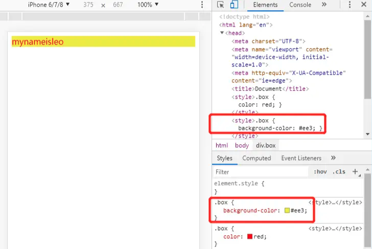
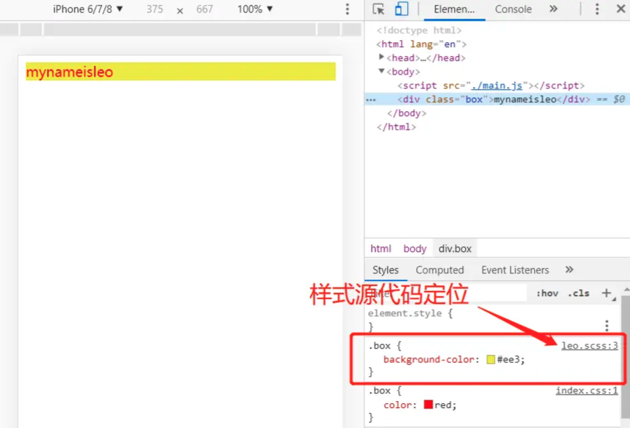
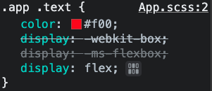
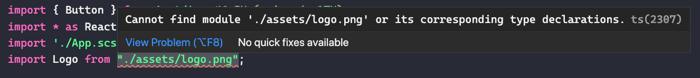
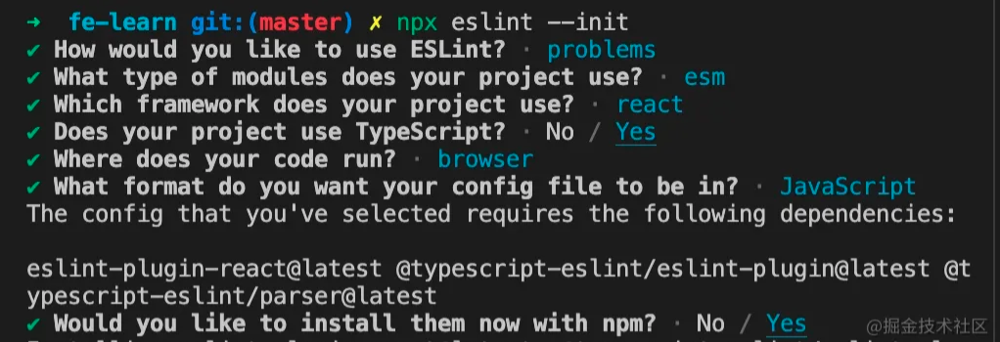
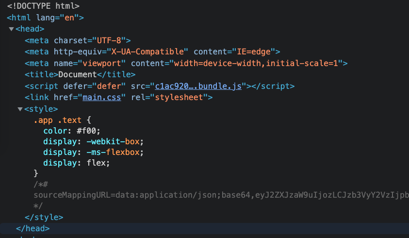
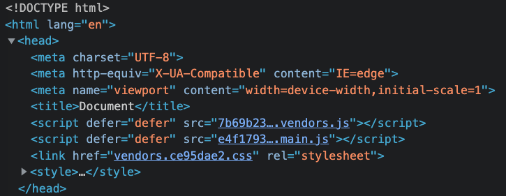

# React-zero-to-one

从零到一搭建 React + TS 项目。


## 一、基础环境搭建


### 1) 初始化项目

新建一个目录然后执行下面的命令初始化项目：

```bash
$ npm init -y
```


### 2) 安装并配置 Webpack

前端不断发展，但很多特性浏览器不一定会支持，`ES6` 模块，`CommonJs` 模块、`Scss/less` 、`jsx` 等等，通过 Webpack 我们可以将所有文件进行打包、压缩混淆，最终转换为浏览器识别的代码。

除了安装 Webpack ，我们需要安装对应的命令行工具 `webpack-cli` ，以及实现了热加载，也就是自动监听我们文件变化然后刷新网页的 `webpack-dev-server` 。

由于这些工具只在开发阶段使用，所以我们安装的时候可以加上 `-D(--save-dev)` 命令进行区分。

```bash
$ npm i webpack webpack-cli webpack-dev-server -D
```

> `webpack-cli` 最好跟 `webpack` 一起安装，单独安装容易出现版本冲突问题

接下来在根目录新建 `webpack.config.js` 进行项目的配置，主要配置入口文件，打包输目录，以及 `devServer` ：

```js
const path = require('path');
const webpack = require("webpack");
const HtmlWebpackPlugin = require('html-webpack-plugin');

module.exports = {
  entry: './src/index.js',
  output: {
    path: path.resolve(__dirname, './dist'),
    // [hash] 在 Webpack 5 中已经废弃了
    // 可以使用 fullhash、chunkhash 或者 contenthash
    filename: '[contenthash].bundle.js',
  },
  devServer: {
    // 在 Webpack 5 中不再使用 contentBase 和 publicPath ，改成了 static
    static: path.resolve(__dirname, './dist'),
    compress: true,
    hot: true,
    open: true,
    host: 'localhost',
    port: '8066'
  },
  plugins: [
    // new webpack.NamedModulesPlugin(),
    new webpack.HotModuleReplacementPlugin(),
    new HtmlWebpackPlugin({
      template: path.join(__dirname, './public/index.html'),
      title: "react-zero-to-one",
      filename: "index.html",
      minify: {
        collapseWhitespace: true,
        removeComments: true,
      }
    })
  ]
}
```

接下来在建一个 `src` 目录，创建 `index.js` ，随便写点内容：

```js
const div = document.createElement("div");
div.innerHTML = "测试内容";
document.body.appendChild(div);
```

再创建一个 `public` 目录，用来放 HTML 文件模板：

```html
<!DOCTYPE html>
<html lang="en">
<head>
  <meta charset="UTF-8">
  <meta http-equiv="X-UA-Compatible" content="IE=edge">
  <meta name="viewport" content="width=device-width, initial-scale=1.0">
  <title>Document</title>
</head>
<body>
  <div id="app"></div>
</body>
</html>
```

然后在 `package.json` 中添加两个 npm script ：

```json
"scripts": {
  "dev": "npx webpack-dev-server --mode development --open",
  "build": "npx webpack --mode production"
}
```

最后执行命令：

```bash
$ npm run dev
```

可以看到项目正常启动。


### 3) 安装 React

React 可以让我们专注于构建用户界面，而不需要再手动维护 dom 元素的更新，当然还可以用 Vue 。

安装核心库 `react` ，以及渲染 Web 的 `react-dom` ：

```bash
$ npm i react react-dom
```

修改 `src/index.js` 的内容如下：

```js
import React from 'react';
import ReactDOM from 'react-dom';

class Hello extends React.Component {
  render() {
    return React.createElement('div', null, `Hello ${this.props.toWhat}`);
  }
}

ReactDOM.render(
  React.createElement(Hello, { toWhat: 'World by React' }, null),
  document.getElementById('app')
)
```

再次启动项目，可以看到正常运行，但是如果我们将上述文件改为 JSX 语法，就发现报错了：

```js
import React from 'react';
import ReactDOM from 'react-dom';

class Hello extends React.Component {
  render() {
    return <div>Hello {this.props.toWhat}</div>;
  }
}

ReactDOM.render(
  <Hello toWhat="World by jsx" />,
  document.getElementById('app')
)
```

> Module parse failed: Unexpected token (6:11)
You may need an appropriate loader to handle this file type, currently no loaders are configured to process this file. See https://webpack.js.org/concepts#loaders

这是因为 JSX 是一个编译时的语法糖，需要经过 babel 编译，下面就来配置 babel 。


### 4) 安装并配置 Babel

`babel` 可以为我们把各种语法、新功能转换为浏览器所能识别的 `js` ，`.jsx` 文件就可以通过 `babel` 进行转换。

这里我们先安装一下 `babel` 以及在 webpack 中使用的 `babel-loader` ：

```bash
$ npm i @babel/core babel-loader -D
```

然后在 webpack 中引入 `babel-loader` ，用来对 `js` 进行转换，更改 webpack.config.js 文件，添加一个配置：

```js
module: {
  rules: [
    {
      test: /\.(js)x?$/,
      exclude: /node_modules/,
      use: {
        loader: 'babel-loader',
      },
    },
  ],
},
```

然后我们来安装 `@babel/preset-react` 来转换 `jsx` 语法：

```bash
$ npm i @babel/preset-react -D
```

在根目录新建 `babel` 的配置文件 `babel.config.js` ：

```js
module.exports  = {
  "presets": [
    "@babel/preset-react"
  ]
}
```

> Babel 7.x 以上可以直接使用 `babel.config.js` ，也可以用 `json` 配置文件

再次运行项目就可以正常使用 JSX 了。

然后我们还可以安装一些其他 `babel` 插件以便使用最新的 `ES` 语法，比如箭头函数、`async await`、问号表达式等等， 需要什么就可以配置什么。当浏览器不支持这些特性时，`babel` 可以帮我们实现 `polyfill` 进行降级。

`@babel/preset-env` 可以用于转换所有 ES 的新语法（不包括还在提案阶段的特性），`core-js` 用于实现 `ployfill`，安装这俩之后各种 ES 最新的特性就都可以放心使用了，对于实验性语法我们可以单独配置 `babel` 的插件。

```bash
$ npm i @babel/preset-env core-js -D
```

然后我们再修改下 `babel` 的配置：

```js
module.exports = {
  "presets": [
    [
      "@babel/preset-env",
      {
        "useBuiltIns": "usage",
        "corejs": 3
      }
    ],
    "@babel/preset-react"
  ],
  "plugins": []
}
```


### 5) 将 babel helper 函数统一引入

通过观察打包后的 `App.tsx` 文件（没有开启 `sourceMap`），可以发现 `babel` 在编译阶段注入了很多 helper 函数，这样就会存在一个问题，在正常的前端项目里面会涉及大量的组件，如果每个组件文件里面都单独注入 helper 函数，会导致打包后的文件体积变得很大：


一种解决思路是将这些函数声明都放在一个 npm 包里面，然后使用的时候从包里面引入。`@babel/runtime` 就是上面说的这个包，把所有语法转换用到的辅助函数集成到了一起：


那么只要将语法转换后的 helper 函数声明手动替换成 `require("@babel/runtime/helpers/...")` 的形式就可以了。 但是这些 helper 函数如果一个个记住并手动引入，会增加很多工作量，这时候可以用 `@babel/plugin-transform-runtime` 这个插件来解决问题：

```bash
$ npm i @babel/plugin-transform-runtime -D
```

> 确保已经装了 `@babel/runtime` ，可以到 `node_modules` 里面看下

然后修改 `babel.config.js` 如下：

```js
module.exports = {
  presets: [
    "@babel/preset-typescript",
    [
      "@babel/preset-env",
      {
        "useBuiltIns": "usage",
        "corejs": 3
      }
    ],
    "@babel/preset-react"
  ],
  plugins: [
    [
      "import",
      {
        "libraryName": "antd",
        "style": 'css'
      }
    ],
    [
      '@babel/plugin-transform-runtime',
      {
        corejs: 3,
        helpers: true,
        regenerator: true,
        useESModules: true,
      },
    ],
  ]
}
```

再次运行项目，报了几个错误：

> Can't resolve '@babel/runtime-corejs3/helpers/esm/classCallCheck'

报错的原因应该跟配置有关系，我们在 `babel.config.js` 里面配置的是 `corejs: 3` ，然后 `@babel/plugin-transform-runtime` 没有去 `@babel/runtime` 里面找，而是到了 `@babel/runtime-corejs3` 里面去找。那就按照提示装一下：

```bash
$ npm i @babel/runtime-corejs3 -D
```

> 安装过程中出现了 `core-js` 安装的提示，貌似 `core-js` 不用单独安装

再次编译之后可以发现，helper 函数都改为统一引入的形式了。


### 6) Babel 编译提案阶段语法

前面提到 `@babel/preset-env` 只编译 ES 新特性，不包括提案阶段的语法。但实际上很多提案阶段的语法已经被广泛使用了，例如装饰器 `@` 、可选链 `?.` 、空值合并运算符 `??` ，为了让 Babel 编译这些语法，可以使用额外的插件：

```bash
$ npm i @babel/plugin-proposal-decorators @babel/plugin-syntax-dynamic-import @babel/plugin-transform-async-to-generator @babel/plugin-transform-regenerator @babel/plugin-proposal-object-rest-spread @babel/plugin-proposal-class-properties -D
```

修改 `babel.config.js` 如下：

```js
module.exports = {
  "presets": [
    "@babel/preset-typescript",
    [
      "@babel/preset-env",
      {
        "useBuiltIns": "usage",
        "corejs": 3
      }
    ],
    "@babel/preset-react"
  ],
  "plugins": [
    // antd 按需引入
    [
      "import",
      {
        "libraryName": "antd",
        "style": 'css'
      }
    ],
    // 将 babel helper 函数统一引入
    [
      '@babel/plugin-transform-runtime',
      {
        corejs: 3,
        helpers: true,
        regenerator: true,
        useESModules: true,
      },
    ],
    // 编译提案阶段语法
    [
      '@babel/plugin-proposal-decorators',
      {
        legacy: true,
      },
    ],
    '@babel/plugin-syntax-dynamic-import',
    '@babel/plugin-transform-async-to-generator',
    '@babel/plugin-transform-regenerator',
    '@babel/plugin-proposal-object-rest-spread',
    '@babel/plugin-proposal-class-properties',
  ]
}
```


### 7) 引入 TypeScript

项目引入 `ts` 的话有两种方式：

- 使用 `TypeScript Compiler (TSC)` 将 `ts` 编译为 `ES5` 以便能够在浏览器中运行，同时进行类型检查；
- 使用 `Babel` 来编译 `TS` ，使用 `TSC` 进行类型检查；

这里的话使用第二种方式，让 `Babel` 和 `TSC` 各司其职。

首先安装 `TypeScript` 以及 React 的 `type` ：

```bash
$ npm i typescript @types/react @types/react-dom -D
```

在项目根目录创建 `tsconfig.json` 配置如下：

```json
{
  "compilerOptions": {
    "target": "es5",
    "module": "ES2020",
    "lib": [
      "dom"
    ],
    // 编译 JS ，即让当前项目兼容 JS
    "allowJs": true,
    "jsx": "react-jsx",
    // 不输出编译内容，只进行类型检查
    "noEmit": true,
    "sourceMap": true,
    /* Strict Type-Checking Options */
    "strict": true,
    "noImplicitAny": true,
    "strictNullChecks": true,
    // 允许使用默认导入形式
    "allowSyntheticDefaultImports": true,
    // 启用 ES7 装饰器语法
    "experimentalDecorators": true,
    "skipLibCheck": true,
  },
  "include": [
    "src"
  ]
}
```

> 也可以使用 `npx tsc --init` 命令生成 `tsconfig.json` 配置文件

接下来进行 `babel` 的配置，安装 `@babel/preset-typescript` ，将我们代码从 `ts` 转为 `js` ：

```bash
$ npm i @babel/preset-typescript -D
```

`babel` 配置文件中加入：

```js
module.exports = {
  "presets": [
    "@babel/preset-typescript",
    [
      "@babel/preset-env",
      {
        "useBuiltIns": "usage",
        "corejs": 3
      }
    ],
    "@babel/preset-react"
  ],
  "plugins": []
}
```

最后在 `webpack.config.js` 中 `babel` 匹配的路径中加入 `tsx` ：

```js
// 打包入口改为 tsx
entry: './src/index.tsx',
module: {
  rules: [
    {
      // 匹配 tsx 后缀
      test: /\.(js|ts)x?$/,
      exclude: /node_modules/,
      use: {
        loader: 'babel-loader',
      },
    },
  ],
},
resolve: {
  // 引入模块的时候可以省略这些后缀
  extensions: ['.tsx', '.ts', '.jsx', '.js'],
}
```

接下来我们在 `src` 目录下创建 `App.tsx` ，内容如下：

```typescript
import * as React from 'react';

type Props = {
  toWhat: string;
};
type State = {

};

export default class App extends React.Component<Props, State>  {
  render() {
    return <div>Hello {this.props.toWhat}</div>;
  }
}
```

然后修改 `src/index.js` 为 `index.tsx` ，内容如下：

```typescript
import * as React from 'react';
import * as ReactDOM from 'react-dom';
import App from "./App";

ReactDOM.render(
  <App toWhat="World by tsx" />,
  document.getElementById('app')
)
```

启动项目可以正常运行。


### 8) 引入 CSS

Webpack 默认只编译 JS 文件，如果还需要编译 CSS 文件，就需要装一下 CSS 的 `loader` ：

```bash
$ npm i style-loader css-loader -D
```

- `css-loader` ： 用于处理 `css` 文件，将 `css` 编译为 JS 模块，使得能在 JS 文件中引入使用；
- `style-loader` ： 用于将 `css` 文件注入到 `index.html` 中的 `<style>` 标签上；

`webpack.config,js` 中添加配置如下：

```js
module: {
  rules: [
    {
      test: /\.css$/,
      // 这里可以看出 loader 解析的顺序是从后往前解析
      use: ["style-loader", "css-loader"]
    }
  ]
}
```

> 这边配置的 loader 主要是**处理第三方组件库的样式**，项目中编写业务组件通常不用 CSS ，而是使用 Sass、Less 等预编译器，对于预编译器的处理下面会讲


### 9) 引入 Sass

`Sass` 是 `css` 的预编译器，可以让我们写样式更顺手。

我们安装一下 `Sass` 以及它的 `loader` ：

```bash
$ npm install sass-loader sass -D
```

`webpack.config.js` 中添加如下配置：

```js
module: {
  rules: [
    {
      test: /\.css$/i,
      use: ['style-loader', 'css-loader'],
    },
    {
      test: /\.s[ac]ss$/i,
      use: [
        // 将 JS 字符串生成为 style 节点
        'style-loader',
        // 将 CSS 转化成 CommonJS 模块
        'css-loader',
        // 将 Sass 编译成 CSS
        'sass-loader',
      ],
    },
  ],
},
```

在 `App.tsx` 加几个类名，引入 `App.scss` ：

```typescript
import * as React from 'react';
import './App.scss';

type Props = {
  toWhat: string;
};
type State = {};

class App extends React.Component<Props, State> {
  render(): JSX.Element {
    return (
      <div className="app">
        <div className="text">Hello</div>
        <div>{this.props.toWhat}</div>
      </div>
    );
  }
}

export default App;
```

```scss
.app {
  .text {
    color: #f00;
  }
}
```

> 注意 Sass 的文件名只能是 `.scss`

再次运行可以看到文字带上颜色了。


### 10) 样式开启 sourceMap

通过上面的配置，我们看到样式只是定位到了 HTML 文件的 `style` 标签里面：



为了方便打包之后我们在项目中调试样式，定位到样式在源文件的位置，可以添加 `SourceMap` ：

```js
rules: [
  {
    test: /\.s[ac]ss$/i,
    use: [
      'style-loader',
      {
        loader: "css-loader",
        options: {
          sourceMap: true
        }
      },
      {
        loader: "sass-loader",
        options: {
          sourceMap: true
        }
      },
    ],
  }
]
```

> 在 `css-loader` 和 `sass-loader` 都可以通过设置 `options` 选项启用 `sourceMap`

再重新打包，看下 `index.html` 的样式，样式已经定位到源文件上了：




### 11) 使用 postcss autoprefixer 添加 CSS 前缀

这里我们用到 `PostCSS` 这个 `loader`，它是一个 CSS **预处理工具**，可以为 CSS3 的属性**添加前缀**，样式格式校验（`stylelint`），提前使用 `CSS` 新特性，实现 `CSS` 模块化，防止 `CSS` 样式冲突。

> 更多参数介绍，可访问中文官网的介绍:
> [《postcss-loader》](https://link.juejin.cn/?target=https%3A%2F%2Fwww.webpackjs.com%2Floaders%2Fpostcss-loader%2F)

首先安装 `PostCSS`：

```bash
$ npm install postcss-loader autoprefixer -D
```

在 `webpack.config.js` 中配置：

```js
const autoPrefixer = require('autoprefixer');

module.exports = {
  // ...
  module: {
    rules: [
      {
        test: /\.s[ac]ss$/i,
        use: [
          'style-loader',
          {
            loader: "css-loader",
            options: {
              sourceMap: true
            }
          },
          {
            loader: "postcss-loader",
            options: {
              sourceMap: true,
              postcssOptions: {
                plugins: [
                  autoPrefixer()
                ]
              }
              // 在 Webpack 4 的写法
              // plugins: loader => [
              //   require('autoprefixer')(),
              // ]
            }
          },
          {
            loader: "sass-loader",
            options: {
              sourceMap: true
            }
          },
        ],
      }
    ]
  }
}
```

还需要在 `package.json` 中添加判断浏览器版本：

```json
// package.json

{
  //...
  "browserslist": [
    "> 1%", // 全球浏览器使用率大于1%，最新两个版本并且是IE8以上的浏览器，加前缀 
    "last 2 versions",
    "not ie <= 8"
  ]
}
```

在 `App.scss` 中添加如下内容测试：

```scss
.app {
  .text {
    color: #f00;
    display: flex;
  }
}
```

可以看到前缀已经被添加上去了：




### 12) Webpack 处理图片和字体

在 Webpack 4 里面通常会用到 `url-loader` 和 `file-loader` ，在 Webpack 5 里面新增 Asset Modules ，不用再装额外的 loader ：

```js
entry: './src/index.tsx',
output: {
  path: path.resolve(__dirname, '../dist'),
  // JS 文件放到 js/ 目录下
  filename: 'js/[contenthash].[name].js',
  // 指定 Asset Modules 的文件名
  // 把图片、字体放到 static/ 目录下
  assetModuleFilename: 'static/[hash][ext][query]',
},
module: {
	rules: [
		{
			test: /\.(woff|woff2|ttf|eot|svg)$/,
		    exclude: /node_modules/,
		    // Webpack 5 新增 Asset Modules ，不再使用 url-loader 和 file-loader
		    type: 'asset/resource',
		    // 也可以单独制定文件名
		    // generator: {
          	//	  filename: 'static/[hash][ext][query]'
        	// }
		},
		{
		    test: /\.(png|jpg|gif|jpeg|ico|cur)$/,
		    exclude: /node_modules/,
		    type: 'asset/resource'
		},
	]
},
```

我们在 `src/assets` 目录下放一张图片，然后到 `App.tsx` 里面引入测试一下：

```typescript
import Logo from "@assets/01.png";

function App() {
	return (
		
	)
}
```

结果发现 TS 报了一个错误，提示模块没有声明：



我们在 `src/d.ts` 目录下建一个 `global.d.ts` 文件，内容如下：

```typescript
declare module '*.css'
declare module '*.less'
declare module '*.scss'
declare module '*.svg'
declare module '*.png'
declare module '*.jpg'
declare module '*.jpeg'
declare module '*.gif'
declare module '*.bmp'
declare module '*.tiff'
```

再回来看就不报错了。


### 13) 模块路径别名

刚才我们引入图片使用了相对路径，但是滥用相对路径会导致维护上的问题，例如下面这个路径，我们很难定位到这个模块是从哪里引入的：

> import xxx from "../../../../xxx"

而且像上面这样做了之后，等于增加了模块的耦合度，以后如果要将这个模块调整到别的目录，所有 `import` 的路径都要修改，非常麻烦。

但是使用绝对路径也不方便，每次都需要从根路径开始写。Webpack 提供了路径别名机制，我们可以在 `resolve` 里面配置一个 `alias` ：

```js
resolve: {
	alias: {
		"@": path.resolve(__dirname, "./src"),
		"@assets": path.resolve(__dirname, "./src/assets"),
    "@components": path.resolve(__dirname, "./src/components"),
    "@views": path.resolve(__dirname, "./src/views"),
    "@utils": path.resolve(__dirname, "./src/views"),
	}
}
```


### 14) Webpack 添加编译进度条

到这边大部分 Webpack 的配置都已经配好了。如果在项目中引入了一个重量级的库，例如 `lodash` 、`moment` ，会发现打包比较慢而且没有进度信息。我们可以添加一个编译进度条：

```bash
$ npm i progress-bar-webpack-plugin chalk -D
```

然后在 `webpack.config.js` 中添加如下配置：

```js
const ProgressBarPlugin =  require("progress-bar-webpack-plugin");
const chalk = require("chalk");

module.exports = {
	plugins: [
		new ProgressBarPlugin({
	      format: `:msg [:bar] ${chalk.green.bold(':percent')} (:elapsed s)`
	    })
	]
}
```


### 15) 配置 ESLint

可以配置 `eslint` 来进行语法上静态的检查，也可以对 `ts` 进行检查：

```bash
$ npm i eslint -D
```

运行下面的命令，初始化一个 `.eslintrc.js` 文件：

```bash
$ npx eslint --init
```

根据提示回答几个问题就行：



> 注意第一个问题选择 check syntax and find problems 就行，代码风格检查交给 Prettier，下面会讲

配置文件生成之后，如果你的 VS Code 装了 ESLint 插件，打开 `.eslintrc.js` 发现 `module.exports` 报错了：


然后 `webpack.config.js` 里面所有 Node.js 的用法也都报错了：


这是因为我们在 `.eslintrc.js` 中配置 `"browser": true` ，所以 Node.js 的写法都标红了。

解决方法很简单，大家一定也都看到过，就是在根目录下建一个 `.eslintignore` 文件：

```
node_modules
build
public
dist
**/*.js
```

添加之后报错就消失了，只对 `src` 目录下的业务代码进行检查。

然后我们在 `package.json` 中可以添加一个 `lint` 命令来修复代码：

```json
"scripts": {
  "dev": "webpack-dev-server --mode development --open",
  "build": "webpack --mode production",
  "lint": "eslint src --fix"
}
```

配合 VS Code 可以做到边写代码边自动检测 `eslint` ，以及保存的时候自动修复 `eslint` 相关错误。

可以安装 ESLint 插件，然后在 VS Code 的 `settings.json` 中添加如下配置：

```json
{
  "eslint.validate": ["javascript", "javascriptreact", "vue", "typescript", "typescriptreact"],
  "editor.codeActionsOnSave": {
    "source.fixAll.eslint": true
  },
}
```

为了使用更完善的 `eslint` 配置，我们也可以直接引用腾讯 `Alloy` 团队的推荐配置：

> https://github.com/AlloyTeam/eslint-config-alloy


### 16) 配置 Prettier

`prettier` 主要做代码风格上的检查，例如字符串双引号还是单引号、缩进、换行问题、是否加尾分号，类似这样的

> 对于 Vue 项目，直接使用 Vetur 就行，自带了格式化，规范就是使用 Prettier

当然 `eslint` 也可以配置这些，但为了分离它们各自的职责，最好还是用 `prettier` 来格式化代码风格。

`prettier` 也和 `eslint` 一样提供了 npm 包和 VS Code 插件两种形式，这边直接装 VS Code 插件，在写代码的时候自动检查格式问题。

然后在根目录新建 `.prettierrc.js` 文件，这里直接引用 [腾讯 Alloy](https://link.juejin.cn/?target=https%3A%2F%2Fgithub.com%2FAlloyTeam%2Feslint-config-alloy) 团队推荐的配置：

```js
module.exports = {
  // max 120 characters per line
  printWidth: 120,
  // use 2 spaces for indentation
  tabWidth: 2,
  // use spaces instead of indentations
  useTabs: false,
  // semicolon at the end of the line
  semi: true,
  // use single quotes
  singleQuote: true,
  // object's key is quoted only when necessary
  quoteProps: 'as-needed',
  // use double quotes instead of single quotes in jsx
  jsxSingleQuote: false,
  // no comma at the end
  trailingComma: 'all',
  // spaces are required at the beginning and end of the braces
  bracketSpacing: true,
  // end tag of jsx need to wrap
  jsxBracketSameLine: false,
  // brackets are required for arrow function parameter, even when there is only one parameter
  arrowParens: 'always',
  // format the entire contents of the file
  rangeStart: 0,
  rangeEnd: Infinity,
  // no need to write the beginning @prettier of the file
  requirePragma: false,
  // No need to automatically insert @prettier at the beginning of the file
  insertPragma: false,
  // use default break criteria
  proseWrap: 'preserve',
  // decide whether to break the html according to the display style
  htmlWhitespaceSensitivity: 'css',
  // vue files script and style tags indentation
  vueIndentScriptAndStyle: false,
  // lf for newline
  endOfLine: 'lf',
  // formats quoted code embedded
  embeddedLanguageFormatting: 'auto',
};
```

`prettier` 同样也要在根目录下建一个 `.prettierignore` 文件：

```
node_modules
dist
build
.prettierignore
.gitignore
.eslintignore
```

同样的，为了保存的时候自动帮我们格式化，可以修改 VS Code 的 `settings.json` ：

```json
{
  "editor.tabSize": 2,
  "editor.formatOnSave": true,
  "editor.defaultFormatter": "esbenp.prettier-vscode",
  "eslint.validate": ["javascript", "javascriptreact", "vue", "typescript", "typescriptreact"],
  "editor.codeActionsOnSave": {
    "source.fixAll.eslint": true
  }
}
```

> 建议把上面配置写到项目根目录的 `.vscode/settings.json` 文件里面，这样配置可以跟项目关联

到这边开发环境基本已经搭建完成，下面介绍业务相关的一些配置。


## 二、业务相关配置


### 1) 引入 antd

运行下面的命令安装 Ant Design 组件库：

```bash
$ npm i antd
```

使用组件库通常都会按需引入，以便减小打包后的体积：

```js
import Button from 'antd/lib/button';  
import 'antd/lib/button/style';
```

但是这样写很麻烦，因此使用按需引入插件，在打包编译期间将 `import` 改为上面的形式：

```bash
$ npm i babel-plugin-import -D
```

在 `babel.config.js` 中配置如下：

```js
module.exports = {
  "presets": [
    "@babel/preset-typescript",
    [
      "@babel/preset-env",
      {
        "useBuiltIns": "usage",
        "corejs": 3
      }
    ],
    "@babel/preset-react"
  ],
  "plugins": [
    [
      "import",
      {
        "libraryName": "antd",
        // true 代表使用 Less
        // 'css' 代表使用 CSS
        "style": "css"
      }
    ]
  ]
}
```

修改 `App.tsx` 如下：

```typescript
import { Button } from "antd";
import * as React from 'react';
import './App.scss';

type Props = {
  toWhat: string;
}
type State = {}

class App extends React.Component<Props, State>  {
  render(): JSX.Element {
    return (
      <div className="app">
        <div className="text">Hello</div>
        <div>{this.props.toWhat}</div>
        <div>
          <Button type="primary">测试按钮</Button>
        </div>
      </div>
    );
  }
}

export default App;
```

重新编译之后正常运行，不过 TS 报了一个错误：


按照提示在 `tsconfig.json` 中添加配置：

```bash
{
	"compilerOptions": {
		"moduleResolution": "node"
	}
}
```


### 2) 将 antd 样式抽取成单独文件

前面我们使用了 `style-loader` 将样式都打包进 `bundle.js` ，然后注入到了 `style` 标签里面。由于第三方组件库通常样式文件很大（即使用了按需引入），如果都打包进 `bundle.js` 显然不是合理的做法，所以我们需要将组件库的样式打包成单独的 CSS 文件。

Webpack4 开始使用 `mini-css-extract-plugin` 插件，而在 1-3 版本使用 `extract-text-webpack-plugin`。

安装插件：

```bash
$ npm install mini-css-extract-plugin -D
```

引入插件：

```js
// webpack.config.js

const MiniCssExtractPlugin = require('mini-css-extract-plugin');
```

然后修改 `rules`，将 `style-loader`，替换成 `MiniCssExtractPlugin.loader` ，然后添加 `plugins` 配置项：

```js
module: {
  rules: [
    {
      test: /\.css$/i,
      use: [
        // 'style-loader',
        MiniCssExtractPlugin.loader,
        'css-loader'
      ],
    },
  ]
},
plugins: [
  new MiniCssExtractPlugin({
    filename: '[name].css', // 最终输出的文件名
    chunkFilename: '[id].css'
  })
]
```

> 注意：抽取样式以后，就不能使用 `style-loader` 

再次编译后可以看到 `antd` 样式是通过单独的 CSS 文件引入的，而 `style` 标签里面只有业务组件的样式：



> 这里有个问题，Vue 项目打包之后，组件库的样式都是在业务组件后面进来的，所以导致业务组件里面没办法覆盖组件库默认样式，需要通过 `::v-deep` 样式穿透


### 3) 第三方库和业务代码打包进不同的 chunks

将 `node_modules` 里面的开发依赖和业务代码分别打包进不同的 chunks ，可以使用 `SplitChunksPlugin` 。

在 Webpack 4 之前版本用的是 `CommonChunksPlugin` ，在 Webpack 4 中改成了 `optimization.splitChunks` 。

在 `webpack.config.js` 中添加如下配置：

```js
module.exports = {
  entry: './src/index.tsx',
  output: {
    path: path.resolve(__dirname, './dist'),
    filename: '[contenthash].[name].js'
  },
  optimization: {
    splitChunks: {
      minSize: 3000,
      cacheGroups: {
        vendors: {
          test: /[\\/]node_modules[\\/]/,
          name: 'vendors',
          // "initial" 针对入口文件做代码分割
          // "all" 把 node_modules 开发依赖都打包进 vendors
          // "async"(默认就是异步，针对异步加载的模块做代分割)
          chunks: 'all',
          // priority: 10,
        },
      }
    }
  }
}
```

再次编译之后可以看到被拆分出两个 chunks ，其中 vendors 是开发依赖，而 main 是业务代码：



推荐阅读：

[有点难的知识点：Webpack Chunk 分包规则详解](https://juejin.cn/post/6961724298243342344)

[「Webpack」从0到1学会 code splitting](https://juejin.cn/post/6979769284612325406)

[剖析 Webpack SplitChunksPlugin 源码: 学完你也能写一个](https://juejin.cn/post/6982157120594509837)


### 4) webpack 配置合并和提取公共配置


### 5) 配置环境变量


### 6) 配置路由


### 7) 配置全局状态管理


### 8) 配置网络请求库


