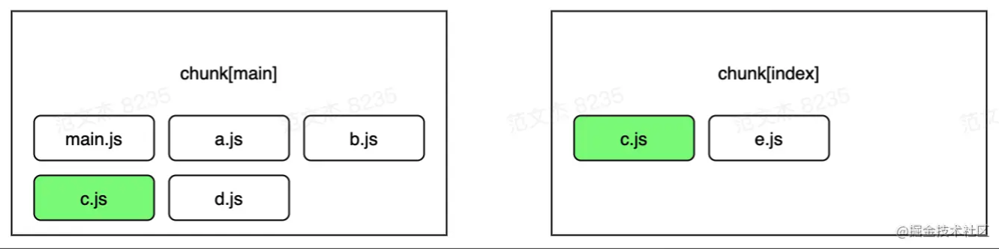

# React-zero-to-one

从零到一搭建 React + TS 项目。


## 一、基础环境搭建


### 1) 确认 Node.js 环境

Node.js 环境是前端之源，如果没有 Node 就没有各种构建环境、本地开发服务器、依赖库管理等。相信每一位前端同学一定都安装了 Node.js ，只不过需要检查一下，安装的 Node 版本是否为 LTS 版本。

简单来说，Node 的主版本分为**奇数版本**和**偶数版本**，每个版本发布之后会持续六个月的时间，六个月之后，奇数版本将变为 EOL (End-Of-Life version) 状态，不再支持，只有偶数版本会变成 Active LTS (long-term support) 状态并且长期支持，这意味着重大的 bug 将在后续的 30 个月内持续得到不断地修复。因此我们在生产环境使用 Node 的时候，应该尽量使用它的 LTS 版本。


### 2) 初始化项目

新建一个目录然后执行下面的命令初始化项目：

```bash
$ npm init -y
```


### 3) 安装并配置 Webpack

前端不断发展，但很多特性浏览器不一定会支持，`ES6` 模块，`CommonJs` 模块、`Scss/less` 、`jsx` 等等，通过 Webpack 我们可以将所有文件进行打包、压缩混淆，最终转换为浏览器识别的代码。

除了安装 Webpack ，我们需要安装对应的命令行工具 `webpack-cli` ，以及实现了热加载，也就是自动监听我们文件变化然后刷新网页的 `webpack-dev-server` 。

由于这些工具只在开发阶段使用，所以我们安装的时候可以加上 `-D(--save-dev)` 命令进行区分。

```bash
$ npm i webpack webpack-cli webpack-dev-server -D
```

> `webpack-cli` 最好跟 `webpack` 一起安装，单独安装容易出现版本冲突问题

接下来在根目录新建 `webpack.config.js` 进行项目的配置，主要配置入口文件，打包输目录，以及 `devServer` ：

```js
const path = require('path');
const webpack = require("webpack");
const HtmlWebpackPlugin = require('html-webpack-plugin');

module.exports = {
  mode: "development",
  entry: './src/index.js',
  output: {
    path: path.resolve(__dirname, './dist'),
    // [hash] 在 Webpack 5 中已经废弃了
    // 可以使用 fullhash、chunkhash 或者 contenthash
    filename: '[contenthash].bundle.js',
    // Webpack 5 清理目录不再需要单独安装插件
    // 如果不清理目录，由于文件哈希机制，新构建出的文件不会覆盖之前的内容，导致构建产物越来越多
    clean: true
  },
  devServer: {
    // 在 Webpack 5 中不再使用 contentBase 和 publicPath ，改成了 static
    static: path.resolve(__dirname, './dist'),
    compress: true,
    hot: true,
    open: true,
    host: 'localhost',
    port: '8066'
  },
  plugins: [
    // new webpack.NamedModulesPlugin(),
    new webpack.HotModuleReplacementPlugin(),
    new HtmlWebpackPlugin({
      template: path.join(__dirname, './public/index.html'),
      title: "react-zero-to-one",
      filename: "index.html",
      minify: {
        collapseWhitespace: true,
        removeComments: true,
      }
    })
  ]
}
```

> 题外话，在真实场景中，我们不会直接使用 `webpack-dev-server`，而采用 `express` + `webpack-dev-middleware` ，配置方法与上面所述的完全相同

接下来在建一个 `src` 目录，创建 `index.js` ，随便写点内容：

```js
const div = document.createElement("div");
div.innerHTML = "测试内容";
document.body.appendChild(div);
```

再创建一个 `public` 目录，用来放 HTML 文件模板：

```html
<!DOCTYPE html>
<html lang="en">
<head>
  <meta charset="UTF-8">
  <meta http-equiv="X-UA-Compatible" content="IE=edge">
  <meta name="viewport" content="width=device-width, initial-scale=1.0">
  <title>Document</title>
</head>
<body>
  <div id="app"></div>
</body>
</html>
```

然后在 `package.json` 中添加两个 npm script ：

```json
"scripts": {
  "dev": "webpack serve --mode development --open",
  "build": "webpack --mode production"
}
```

最后执行命令：

```bash
$ npm run dev
```

可以看到项目正常启动。


### 4) 安装 React

React 可以让我们专注于构建用户界面，而不需要再手动维护 dom 元素的更新，当然还可以用 Vue 。

安装核心库 `react` ，以及渲染 Web 的 `react-dom` ：

```bash
$ npm i react react-dom
```

修改 `src/index.js` 的内容如下：

```js
import React from 'react';
import ReactDOM from 'react-dom';

class Hello extends React.Component {
  render() {
    return React.createElement('div', null, `Hello ${this.props.toWhat}`);
  }
}

ReactDOM.render(
  React.createElement(Hello, { toWhat: 'World by React' }, null),
  document.getElementById('app')
)
```

再次启动项目，可以看到正常运行，但是如果我们将上述文件改为 JSX 语法，就发现报错了：

```js
import React from 'react';
import ReactDOM from 'react-dom';

class Hello extends React.Component {
  render() {
    return <div>Hello {this.props.toWhat}</div>;
  }
}

ReactDOM.render(
  <Hello toWhat="World by jsx" />,
  document.getElementById('app')
)
```

> Module parse failed: Unexpected token (6:11)
You may need an appropriate loader to handle this file type, currently no loaders are configured to process this file. See https://webpack.js.org/concepts#loaders

这是因为 JSX 是一个编译时的语法糖，需要经过 babel 编译，下面就来配置 babel 。


### 5) 安装并配置 Babel

`babel` 可以为我们把各种语法、新功能转换为浏览器所能识别的 `js` ，`.jsx` 文件就可以通过 `babel` 进行转换。

> `.jsx` 实际上和 `.vue` 类似，在开发阶段通过 IDE 进行语法支持，打包编译阶段通过专门的 loader 去编译

这里我们先安装一下 `@babel/core` 以及在 webpack 中使用的 `babel-loader` ：

```bash
$ npm i @babel/core babel-loader -D
```

> Babel 采用**微内核**架构，核心功能非常小，大部分功能都是通过插件扩展进行实现的。`@babel/core` 就是微内核架构中的内核，主要处理这些任务：
>
> - 加载并处理配置；
> - 加载插件；
> - 将代码通过 parse 转换成 AST ；
> - 调用 Traverser 遍历整个 AST ，并使用**访问者模式**对 AST 进行转换；
> - 生成代码，包括 SourceMap 转换和源代码生成；
>
> Babel  的运行分为三个阶段：解析、转换、生成。自 Babel 6.0 起，就不再对代码进行 `transform` ，只负责 `parse` 和 `generate` 的过程，代码的 `transform` 过程全部交给一个个 `plugin` 去做。因此，在没有配置任何 `plugin` 的情况下，经过 `babel` 输出的代码是没有改变的。

然后在 webpack 中引入 `babel-loader` ，用来对 `js` 进行转换，更改 webpack.config.js 文件，添加一个配置：

```js
module: {
  rules: [
    {
      test: /\.(js)x?$/,
      exclude: /node_modules/,
      use: {
        loader: 'babel-loader',
      },
    },
  ],
},
```

> 假如不用 webpack 而是希望通过 `npx babel` 命令去编译模块，则需要安装 `@babel/cli`

然后我们来安装 `@babel/preset-react` 来转换 `jsx` 语法：

```bash
$ npm i @babel/preset-react -D
```

在根目录新建 `babel` 的配置文件 `babel.config.js` ：

```js
module.exports  = {
  presets: [
    "@babel/preset-react"
  ]
}
```

> Babel 可以使用单独配置文件，也可以将配置写到 `package.json` 里面，还可以通过 `babel-loader` 传递配置
>
> Babel 配置文件一般是根目录下的 `.babelrc` ，Babel 7.x 以上可以直接使用 `babel.config.js` ，也可以用 `json` 配置文件

再次运行项目就可以正常使用 JSX 了。

实际上 Babel 最初是设计用来将 ECMAScript 2015+ 的代码转换成后向兼容的代码，主要工作就是**语法转换**和 **polyfill** 。

有的环境下可能需要转换几十种不同语法的代码，则需要配置几十个`plugin`，这显然会非常繁琐。所以，为了解决这种问题，`babel`提供了预设插件机制`preset`，`preset`中可以**预设置一组插件来便捷的使用这些插件所提供的功能**。目前，`babel`官方推荐使用`@babel/preset-env`预设插件。

`@babel/preset-env`主要的作用是用来转换那些已经被**正式纳入`TC39`中的语法**。所以它无法对那些还在提案中的语法进行处理，对于处在 `stage` 中的语法，需要安装对应的 `plugin` 进行处理。

除了语法转换，`@babel/preset-env`另一个重要的功能是**对`api`的处理，也就是在代码中引入`polyfill`**。假如没有进行 ployfill ，通过观察编译后的代码，`let` 、`const` 会被编译成 `var` ，箭头函数会被编译为普通函数等等，但是 `Symbol` 、`Promise` 、`[].includes` 、`arr[Symbol.iterator]()` 等 api 还是保持原样输出。`@babel/preset-env`主要是依赖`core-js`来处理`api`的兼容性，所以需要事先安装`core-js`。当设置了`useBuiltIns`选项（不为`false`）时，就会使用`core-js`来对`api`进行处理。

```bash
$ npm i @babel/preset-env core-js -D
```

然后我们再修改下 `babel` 的配置：

```js
module.exports = {
  presets: [
    [
      "@babel/preset-env",
      {
        // false 代表不引入 polyfill
        // entry 会根据配置的 browserslist 将目标浏览器不兼容的 polyfill 全量引入
        // usage 会根据配置的 browserslist 以及代码中用到的 API 按需添加 polyfill
        useBuiltIns: "usage",
        corejs: 3
      }
    ],
    "@babel/preset-react"
  ],
  plugins: []
}
```

这边补充一下，编译一个前端项目，一般需要安装如下依赖：

- `@babel/core`：核心库
- `babel-loader`：配合 Webpack 打包场景使用
- `@babel/preset-env`：语法转换的预设插件集，同时支持 api 兼容
- `@babel/preset-react`：编译 React 的 JSX 语法
- `@babel/preset-typescript`：可选，编译 TypeScript 语法

:::tip

`@babel/core` 是核心库，里面包含：

- `@babel/parser`：一个 ast 解析器，之前叫 Babylon，基于 acorn 魔改而来，负责解析生成 ast
- `@babel/traverse`：负责通过访问者模式遍历并操作 ast 节点
- `@babel/generator`：负责根据 ast 生成代码

`babel-loader` 用于配合 Webpack 打包场景使用，如果想通过命令行的方式使用，则需要安装 `@babel/cli`

`@babel/preset-env` 的 api 兼容是通过引入 `core-js` polyfill 实现的。`core-js` 引入有多种方式，可以配置 `entry`，即在入口文件处根据根据 browserslist 配置需要适配的目标环境全量引入 polyfill，也可以配置 `usage`，根据 browserslist 配置和实际用的 api 按需引入 polyfill。`@babel/preset-env` 是通过全局污染的形式引入的，一般在前端项目中没问题，但是作为第三方库就不合适了，这时候需要使用 `@babel/plugin-transform-runtime` 通过沙箱机制引入 polyfill，这种引入方式有个缺点，无法根据 browserslist 配置动态调整引入的 polyfill。

`@babel/preset-typescript` 实际上就是简单删除掉类型注解。因为 Babel 是单文件处理，不可能进行类型检查，类型检查可以交给 VSCode 插件，或者 `ForkTsCheckerWebpackPlugin` 单独起一个进程进行类型检查，这时候 tsc 的作用就是类型检查器，需要配置 `"noEmit": true`。

:::

[「前端基建」探索不同项目场景下Babel最佳实践方案](https://juejin.cn/post/7051355444341637128)

[前端工程化（7）：你所需要知道的最新的babel兼容性实现方案](https://juejin.cn/post/6976501655302832159)


### 6) 将 babel helper 函数统一引入

通过观察打包后的 `App.tsx` 文件（没有开启 `sourceMap`），可以发现 `babel` 在编译阶段注入了很多 helper 函数，这样就会存在一个问题，在正常的前端项目里面会涉及大量的组件，如果每个组件文件里面都单独注入 helper 函数，会导致打包后的文件体积变得很大：


一种解决思路是将这些函数声明都放在一个 npm 包里面，然后使用的时候从包里面引入。`@babel/runtime` 就是上面说的这个包，把所有语法转换用到的辅助函数集成到了一起。

> `@babel/runtime` 是由 Babel 提供的 polyfill 库，它本身就是由 `core-js` 与 `regenerator-runtime` 组成，除了做简单的合并与映射外，并没有做任何额外的加工

那么只要将语法转换后的 helper 函数声明手动替换成 `require("@babel/runtime/helpers/...")` 的形式就可以了。 但是这些 helper 函数如果一个个记住并手动引入，会增加很多工作量，事实上严谨的使用还要配合 `interopRequireDefault()` ，这时候可以用 `@babel/plugin-transform-runtime` 这个插件来解决问题：

```bash
$ npm i @babel/plugin-transform-runtime -D
```

> 确保已经装了 `@babel/runtime` ，可以到 `node_modules` 里面看下

`@babel/plugin-transform-runtime` 可以**自动且按需进行 polyfill** ，从一定程度上控制了 `polyfill` 文件的大小。此外插件会实现一个**沙盒 (sandbox)** ，没有全局变量和 `prototype` 污染。通过观察转换后的代码，插件至始至终没有在 Global 对象下挂在全局的 `Symbol` 和 `Promise` 变量，这样一来如果使用 bluebird 之类的第三方 polyfill 也不会受此影响。

看大佬的文章说 `@babel/plugin-transform-runtime` 不会对实例方法进行 polyfill ，例如数组的 `includes` 和 `filter` ，但是对静态方法会进行 polyfill ，例如 `Array.isArray` 。经过本人实验，这是在 `corejs` 配置项设为 `2` 的结果。不过 `corejs` 设为 `3` 之后，实例方法就会被 polyfill 。

这边总结下 `@babel/plugin-transform-runtime` 主要的三个作用：

- 自动引入 `@babel/runtime/regenerator` ，当你使用了 `generator/async` 函数 (通过 `regenerator` 选项打开，默认为 `true`)
- 提取一些 babel 中的 helper 函数来达到减小打包体积的作用
- 如果开启了 `corejs` 选项(默认为 `false`)，会自动建立一个沙箱环境，避免和全局引入的 polyfill 产生冲突

然后修改 `babel.config.js` 如下：

```js
module.exports = {
  presets: [
    "@babel/preset-typescript",
    [
      "@babel/preset-env",
      {
        useBuiltIns: "usage",
        corejs: 3
      }
    ],
    "@babel/preset-react"
  ],
  plugins: [
    [
      "import",
      {
        libraryName: "antd",
        style: 'css'
      }
    ],
    [
      '@babel/plugin-transform-runtime',
      {
        // false 从 @babel/runtime 中引入 helper 函数
        // 2 从 @babel/runtime-corejs2 中引入 helper 函数和 polyfill
        // 3 从 @babel/runtime-corejs3 中引入 helper 函数和 polyfill
        corejs: 3,
        helpers: true,
        regenerator: true,
        useESModules: true,
      },
    ],
  ]
}
```

由于我们给 `@babel/plugin-transform-runtime` 的 `corejs` 配置项传了 `3` ，因此需要安装下 `@babel/runtime-corejs3` ：

```bash
$ npm i @babel/runtime-corejs3 -D
```

再次编译之后可以发现，helper 函数都改为统一引入的形式了。


### 7) Babel 编译提案阶段语法

前面提到 `@babel/preset-env` 只编译被正式纳入 TC39 的语法特性，不能编译提案阶段的语法。但实际上很多提案阶段的语法已经被广泛使用了，例如装饰器 `@` 、可选链 `?.` 、空值合并运算符 `??` ，为了让 Babel 编译这些语法，可以使用额外的插件：

> https://babeljs.io/docs/en/plugins-list

在 TypeScript 项目中通常会安装如下插件，不过里面大部分已经纳入了 TC39 ，只要安装最新版本的 `@babel/preset-env` 就可以了，不用单独安装：

```js
// 装饰器语法 `@`，还在提案阶段
@babel/plugin-proposal-decorators
// 可选链操作符 `?.`，ES2020 语法
@babel/plugin-proposal-optional-chaining
// 空值合并运算符 `??`，ES2020 语法
@babel/plugin-proposal-nullish-coalescing-operator
// 动态引入 `import()`，ES2020 语法
@babel/plugin-syntax-dynamic-import
// 将 ES2017 async 函数编译为 ES2015 generator
@babel/plugin-transform-async-to-generator
// Facebook 提供的运行时库，ES2015 generator 和 yield 的 polyfill
@babel/plugin-transform-regenerator
// 对象展开，ES2018 语法
@babel/plugin-proposal-object-rest-spread
// 类属性，ES2022 语法
@babel/plugin-proposal-class-properties
```

因此这边实际上只需要装 `decorator` 插件就可以：

```bash
$ npm i @babel/plugin-proposal-decorators -D
```

需要注意几个问题：

动态引入 `import()` 插件不包含 `Promise` 的实现，如果在不支持 `Promise` 的环境使用，则需要引入 `Promise` 和 `Iterator` 的 polyfill ；

ES2015 的展开运算符实际上只适用于展开到数组的情形，并且内部是基于 `for...of` 迭代，因此被展开的也必须是可迭代对象（实现了 `Iterator` 接口的对象，例如数组、字符串、`Set` 、`Map`）。直到 ES2018 才将展开运算符扩充到对象使用，允许将普通对象或者可迭代对象展开到一个普通对象内，用法等价于 `Object.assign()` 。但是注意普通对象仍然不能展开到数组（因为普通对象没有实现 `Iterator` 接口）。

类属性语法，Babel 官网有一个例子：

```js
class Bork {
  //Property initializer syntax
  instanceProperty = "bork";
  boundFunction = () => {
    return this.instanceProperty;
  };

  //Static class properties
  static staticProperty = "babelIsCool";
  static staticFunction = function() {
    return Bork.staticProperty;
  };
}
```

无论是实例属性/方法，还是静态属性/方法都会被转换。需要注意的是，这边的实例属性/方法，会作为对象的自有属性，不会挂载到原型上：

```js
let myBork = new Bork();

//Property initializers are not on the prototype.
console.log(myBork.__proto__.boundFunction); // > undefined
```

> 相当于在类的 `constructor` 内部初始化，只不过写法更简洁，配合 TS 使用更佳

然后我们修改 `babel.config.js` 如下：

```js
module.exports = {
  presets: [
    "@babel/preset-typescript",
    [
      "@babel/preset-env",
      {
        useBuiltIns: "usage",
        corejs: 3
      }
    ],
    "@babel/preset-react"
  ],
  plugins: [
    // antd 按需引入
    [
      "import",
      {
        libraryName: "antd",
        style: 'css'
      }
    ],
    // 将 babel helper 函数统一引入
    [
      '@babel/plugin-transform-runtime',
      {
        corejs: 3,
        helpers: true,
        regenerator: true,
        useESModules: true,
      },
    ],
    // 编译提案阶段语法
    [
      '@babel/plugin-proposal-decorators',
      {
        legacy: true,
      },
    ]
  ]
}
```


### 8) @babel/preset-module

这边的内容参考了卡老师的文章：

[Chrome团队：如何曲线拯救KPI](https://juejin.cn/post/6989235408970186783)

我们知道 `@babel/preset-env` 是根据 `target` 中配置的目标浏览器版本，将 ES 新语法编译为 ES5 语法。但是这样的编译是有代价的，就是编译之后代码量激增。

事实上，某些高级语法，现代浏览器可能或多或少已经支持了，只是支持度不好。

所以，一个更好的思路是：**将不支持的语法替换为已支持的语法**，这样就能省去特性实现这部分代码。


这种浏览器间差异带来的优化空间，`Babel`团队很难独自完成。所以，`Chrome`团队与其合作开发了`@babel/preset-modules`，并且已经作为`bugfixes`参数集成到`@babel/preset-env`中。

https://github.com/babel/preset-modules

如果你安装的 `@babel/preset-env` 版本在 7.9.0 以上，只要通过 `bugfixes: true` 就可以启用 `@babel/preset-modules` 的特性，而且还支持自定义 `target` ，不用单独再安装插件。这个特性将在 Babel 8 被默认启用。

根据官方的说法，启用这个特性之后，`@babel/preset-env` 会根据目标浏览器的支持程度，尝试将 broken syntax 编译为 closest *non-broken modern syntax* ，可以极大缩小编译后代码的体积（取决于 `target` 的配置和使用了多少新语法）。

[@Babel/preset-env - Babel 官方文档](https://babeljs.io/docs/en/babel-preset-env/#bugfixes)


### 9) 引入 TypeScript

项目引入 `ts` 的话有两种方式：

- 使用 `TypeScript Compiler (TSC)` 将 `ts` 编译为 `ES5` 以便能够在浏览器中运行，同时进行类型检查；
- 使用 `Babel` 来编译 `TS` ，使用 `TSC` 进行类型检查；

这里的话使用第二种方式，让 `Babel` 和 `TSC` 各司其职。

首先安装 `TypeScript` 以及 React 的 `type` ：

```bash
$ npm i typescript @types/react @types/react-dom -D
```

在项目根目录创建 `tsconfig.json` 配置如下：

```json
{
  "compilerOptions": {
    "target": "es5",
    "module": "ES2020",
    "lib": [
      "dom"
    ],
    // 编译 JS ，即让当前项目兼容 JS
    "allowJs": true,
    "jsx": "react-jsx",
    // 不输出编译内容，只进行类型检查
    "noEmit": true,
    "sourceMap": true,
    /* Strict Type-Checking Options */
    "strict": true,
    "noImplicitAny": true,
    "strictNullChecks": true,
    // 允许使用默认导入形式
    "allowSyntheticDefaultImports": true,
    // 启用 ES7 装饰器语法
    "experimentalDecorators": true,
    "skipLibCheck": true,
  },
  "include": [
    "src"
  ]
}
```

> 也可以使用 `npx tsc --init` 命令生成 `tsconfig.json` 配置文件

接下来进行 `babel` 的配置，安装 `@babel/preset-typescript` ，将我们代码从 `ts` 转为 `js` ：

```bash
$ npm i @babel/preset-typescript -D
```

`babel` 配置文件中加入：

```js
module.exports = {
  presets: [
    // 加载 @babel/preset-typescript 插件
    "@babel/preset-typescript",
    [
      "@babel/preset-env",
      {
        "useBuiltIns": "usage",
        "corejs": 3
      }
    ],
    "@babel/preset-react"
  ],
  plugins: []
}
```

最后在 `webpack.config.js` 中 `babel` 匹配的路径中加入 `tsx` ：

```js
// 打包入口改为 tsx
entry: './src/index.tsx',
module: {
  rules: [
    {
      // 匹配 tsx 后缀
      test: /\.(js|ts)x?$/,
      exclude: /node_modules/,
      use: {
        loader: 'babel-loader',
      },
    },
  ],
},
resolve: {
  // 引入模块的时候可以省略这些后缀
  extensions: ['.tsx', '.ts', '.jsx', '.js', '.json', '.d.ts'],
}
```

这样的话，webpack 在遇到 TS 文件时，会调用 `babel-loader` 处理这个文件，由 Babel 将这个文件转换成标准 JavaScript 文件，然后将处理结果交还给 webpack ，webpack 继续后面的流程。

那么 Babel 是怎么将 TypeScript 文件转换成标准 JavaScript 文件的呢？答案是**直接删除掉类型注解**。先看一下 Babel 的工作流程，Babel 主要有三个处理步骤：解析、转换和生成。

1. 解析：将源代码处理为 AST ，对应 `@babel/parser` ；
2. 转换：对 AST 进行遍历，在此过程中对节点进行添加、更新、移除等操作，对应 `@babel/traverse` ；
3. 生成：把转换后的 AST 转换成字符串形式的代码，同时创建源码映射，对应 `@babel/generator` ；

那么在加入 `@babel/preset-typescript` 之后，Babel 会在第二步转换过程中，调用 `@babel/plugin-transform-typescript` 插件，遍历到类型注解节点，直接移除。

使用 Babel ，不仅能处理 TypeScript ，语法转换、polyfill 等功能也能一并享受。并且由于 Babel 只是移除类型注解节点，所以速度相当快。但是这边有一个问题，既然 Babel 把类型注解移除了，我们写 TypeScript 还有什么意义呢？我认为主要有以下几点考虑：

1. 性能方面，移除类型注解速度最快。收集类型并验证类型是否正确，是一个相当耗时的操作。
2. Babel 本身的限制。进行类型验证之前，需要解析项目中所有的文件，收集类型信息。而 Babel 只是一个**单文件处理工具**。Webpack 在调用 loader 处理文件时，也是一个文件一个文件调用的。所以 Babel 想验证类型也做不到。并且 Babel 的三个工作步骤中，并没有输出错误的功能。
3. 没有必要。类型验证错误提示可以交给编辑器。

当然，由于 Babel 的单文件特性，`@babel/preset-typescript` 对于需要收集完整类型系统信息才能正确运行的 TypeScript 语言特性，支持不是很好，如 const enums 等。

[TypeScript是如何工作的](https://juejin.cn/post/7007251289721536543)


接下来我们在 `src` 目录下创建 `App.tsx` ，内容如下：

```typescript
import * as React from 'react';

type Props = {
  toWhat: string;
};
type State = {

};

export default class App extends React.Component<Props, State>  {
  render() {
    return <div>Hello {this.props.toWhat}</div>;
  }
}
```

然后修改 `src/index.js` 为 `index.tsx` ，内容如下：

```typescript
import * as React from 'react';
import * as ReactDOM from 'react-dom';
import App from "./App";

ReactDOM.render(
  <App toWhat="World by tsx" />,
  document.getElementById('app')
)
```

启动项目可以正常运行。


### 10) 开启 sourceMap

源码打包编译之后，代码的可读性下降，不利于代码调试，打断点不能定位到原始位置。为便于调试，webpack 提供了 sourceMap 功能，可以将编译后的代码映射回源代码。开启 `sourceMap` 很简单：

```js
devtool: "source-map"
```

开启 `sourceMap` 会拖慢打包速度，webpack 提供了多种类型可以使用，其中 `source-map` 最完整，可以精确定位到源码，但是速度最慢，生成的 `.map` 文件体积最大，其他还包括  `eval` 、`inline` 、`cheap` 等。开发环境对 sourceMap 的要求是：快（eval），信息全（module），且由于此时代码未压缩，我们并不那么在意代码列信息（cheap），所以开发环境推荐配置：

```js
devtool: "eval-cheap-module-source-map"
```

> 这也是 Vue-cli 中的默认配置

在生产环境下，我们并不希望任何人都可以在浏览器直接看到我们未编译的源码，所以可以选择不开启 sourceMap 。但很多时候又需要 sourceMap 来定位错误信息，这种情况下，我们希望 webpack 会生成 sourcemap 文件以提供给错误收集工具比如 sentry，另一方面又不会为 bundle 添加引用注释，以避免浏览器使用，我们可以设置：

```js
devtool: "hidden-source-map"
```

有关 `sourceMap` 的介绍可以参考：

[何为SourceMap？讲讲SourceMap食用姿势](https://juejin.cn/post/7008039749747212319)

[万字长文：关于sourcemap，这篇文章就够了](https://juejin.cn/post/6969748500938489892)


### 11) 引入 CSS

Webpack 默认只编译 JS 文件，如果还需要编译 CSS 文件，就需要装一下 CSS 的 `loader` ：

```bash
$ npm i style-loader css-loader -D
```

- `css-loader` ： 用于处理 `css` 文件，将 `css` 编译为 JS 模块，使得能在 JS 文件中引入使用，同时支持 CSS module；
- `style-loader` ： 用于将 `css` 文件注入到 `index.html` 中的 `<style>` 标签上，用于开发环境，同时提供样式热更新；

`webpack.config,js` 中添加配置如下：

```js
module: {
  rules: [
    {
      test: /\.css$/,
      // 这里可以看出 loader 解析的顺序是从后往前解析
      use: ["style-loader", "css-loader"]
    }
  ]
}
```

> 这边配置的 loader 主要是 **处理第三方组件库的样式**，项目中编写业务组件通常不用 CSS ，而是使用 Sass、Less 等预编译器，对于预编译器的处理下面会讲

关于 `css-loader` 的说明：

`css-loader` 可以传入一个配置项，常用的有三个配置：

```js
module.exports = {
  module: {
    rules: [
      {
        test: /\.css$/i,
        loader: "css-loader",
        options: {
          url: true, // 处理 `url()` 函数
          import: true, // 处理 `@import`
          modules: undefined, // 为匹配 /\.module\.\w+$/i 的文件启用 CSS module
        },
      },
    ],
  },
};
```

以上三个配置均为默认配置，`css-loader` 默认会处理 `url()` 函数，处理之后如下：

```css
url(image.png) => require('./image.png')
```

> 引入路径支持模块路径别名

`css-loader` 默认会解析 `@import`：

```css
@import 'style.css' => require('./style.css')
```

> 引入路径支持模块路径别名

`css-loader` 默认会为匹配 `/\.module\.\w+$/i` 启用 CSS module（不需要手动配置即可启用），配置为 `true` 则为所有文件启用 CSS module，如果不需要 CSS module，设置为 `false` 值会提升性能，因为避免了 CSS Modules 特性的解析。

### 12) 引入 Sass

`Sass` 是 `css` 的预编译器，可以让我们写样式更顺手。

我们安装一下 `Sass` 以及它的 `loader` ：

```bash
$ npm install sass-loader sass -D
```

`webpack.config.js` 中添加如下配置：

```js
module: {
  rules: [
    {
      test: /\.css$/i,
      use: ['style-loader', 'css-loader'],
    },
    {
      test: /\.s[ac]ss$/i,
      use: [
        // 将 JS 字符串生成为 style 节点
        'style-loader',
        // 将 CSS 转化成 CommonJS 模块
        'css-loader',
        // 将 Sass 编译成 CSS
        'sass-loader',
      ],
    },
  ],
},
```

在 `App.tsx` 加几个类名，引入 `App.scss` ：

```typescript
import * as React from 'react';
import './App.scss';

type Props = {
  toWhat: string;
};
type State = {};

class App extends React.Component<Props, State> {
  render(): JSX.Element {
    return (
      <div className="app">
        <div className="text">Hello</div>
        <div>{this.props.toWhat}</div>
      </div>
    );
  }
}

export default App;
```

```scss
.app {
  .text {
    color: #f00;
  }
}
```

> 注意 Sass 的文件名只能是 `.scss`

再次运行可以看到文字带上颜色了。


### 13) 样式开启 sourceMap

通过上面的配置，我们看到样式只是定位到了 HTML 文件的 `style` 标签里面：


为了方便打包之后我们在项目中调试样式，定位到样式在源文件的位置，可以添加 `SourceMap` ：

```js
rules: [
  {
    test: /\.s[ac]ss$/i,
    use: [
      'style-loader',
      {
        loader: "css-loader",
        options: {
          sourceMap: true
        }
      },
      {
        loader: "sass-loader",
        options: {
          sourceMap: true
        }
      },
    ],
  }
]
```

> 在 `css-loader` 和 `sass-loader` 都可以通过 `options` 选项设置 `sourceMap`，默认值都是 `compiler.devtool`，如果 `devtool` 选项启用 sourceMap，那么 CSS 的 sourceMap 也会启用

再重新打包，看下 `index.html` 的样式，样式已经定位到源文件上了：


### 14) 生产环境使用 postcss autoprefixer 添加 CSS 前缀

这里我们用到 `PostCSS` 这个 `loader`，它是一个 CSS **预处理工具**，可以为 CSS3 的属性**添加前缀**，样式格式校验（`stylelint`），提前使用 `CSS` 新特性，实现 `CSS` 模块化，防止 `CSS` 样式冲突。

> 更多参数介绍，可访问中文官网的介绍:
> [《postcss-loader》](https://link.juejin.cn/?target=https%3A%2F%2Fwww.webpackjs.com%2Floaders%2Fpostcss-loader%2F)

首先安装 `PostCSS`：

```bash
$ npm install postcss-loader autoprefixer -D
```

在 `webpack.config.js` 中配置：

```js
const autoPrefixer = require('autoprefixer');

module.exports = {
  // ...
  module: {
    rules: [
      {
        test: /\.s[ac]ss$/i,
        use: [
          'style-loader',
          {
            loader: "css-loader",
            options: {
              sourceMap: true
            }
          },
          {
            loader: "postcss-loader",
            options: {
              sourceMap: true,
              postcssOptions: {
                plugins: [
                  autoPrefixer()
                ]
              }
              // 在 Webpack 4 的写法
              // plugins: loader => [
              //   require('autoprefixer')(),
              // ]
            }
          },
          {
            loader: "sass-loader",
            options: {
              sourceMap: true
            }
          },
        ],
      }
    ]
  }
}
```

还需要在 `package.json` 中添加判断浏览器版本：

```json
// package.json

{
  //...
  "browserslist": [
    "> 1%", // 全球浏览器使用率大于1%，最新两个版本并且是IE8以上的浏览器，加前缀 
    "last 2 versions",
    "not ie <= 8"
  ]
}
```

在 `App.scss` 中添加如下内容测试：

```scss
.app {
  .text {
    color: #f00;
    display: flex;
  }
}
```

可以看到前缀已经被添加上去了：


### 15) Webpack 处理图片和字体

> Webpack 只会打包 JS 文件，如果要打包其它文件就需要加上相应的 loader

在 Webpack5 之前，我们一般都会使用以下几个 loader 来处理一些常见的静态资源，比如 PNG 图片、SVG 图标等等，他们的最终的效果大致如下所示：

- raw-loader：允许将文件处理成一个字符串导入
- file-loader：将文件打包导到输出目录，并在 import 的时候返回一个文件的 URI
- url-loader：当文件大小达到一定要求的时候，可以将其处理成 base64 的 URIS ，内置 file-loader

在 Webpack 4 里面通常会用到 `url-loader` 和 `file-loader` ，对于体积较小的图片，可以使用 `url-loader` 转为 Base64 ，然后通过 DataURL 引入（在雅虎军规中被称为 Inline Image），避免额外的网络请求。但是转成 Base64 存在一个问题，文件的体积会比原来大三分之一，对于体积较大的图片就不合适了，这个时候就可以使用 `file-loader` ，直接将图片拷贝到 dist 目录下，然后修改打包后文件引用路径，使之指向正确的文件。实际上，`url-loader` 已经封装了 `file-loader` ，通过配置 `limit` 参数，小于 `limit` 字节的文件会被转为 DataURL ，大于 `limit` 的会使用 `file-loader` 进行 copy 。

```js
module: {
  rules: [
    {
      test: /\.(png|svg|jpg|jpeg|gif)$/,
      include: [path.resolve(__dirname, 'src/')],
      use: [
        {
          loader: 'url-loader', // 根据图片大小，把图片转换成 base64
          options: {
            limit: 10000
          }, 
        }
      ]
  	}
  ]
}
```

对于字体文件直接使用 `file-loader` ：

```js
module: {
  rules: [
    {
      test: /\.(woff|woff2|eot|ttf|otf)$/,
      include: [path.resolve(__dirname, 'src/')],
      use: [ 'file-loader' ]
  	}
  ]
}
```

在 Webpack 5 里面新增 Asset Modules 提供了内置的静态资源构建能力，我们不需要安装额外的 loader，仅需要简单的配置就能实现静态资源的打包和分目录存放：

```js
entry: './src/index.tsx',
output: {
  path: path.resolve(__dirname, '../dist'),
  // JS 文件放到 js/ 目录下
  filename: 'js/[contenthash].[name].js',
  // 指定 Asset Modules 的文件名
  // 把图片、字体放到 static/ 目录下
  assetModuleFilename: 'static/[hash][ext][query]',
},
module: {
	rules: [
		{
			test: /\.(woff|woff2|ttf|eot|svg)$/,
		    exclude: /node_modules/,
		    // Webpack 5 新增 Asset Modules ，不再使用 url-loader 和 file-loader
		    type: 'asset/resource',
		    // 也可以单独制定文件名
		    // generator: {
          	//	  filename: 'static/[hash][ext][query]'
        	// }
		},
		{
		    test: /\.(png|jpg|gif|jpeg|ico|cur)$/,
		    exclude: /node_modules/,
		    type: 'asset/resource'
		},
	]
},
```

其中 type 取值如下几种：

- asset/source ——功能相当于 raw-loader。
- asset/inline——功能相当于 url-loader，若想要设置编码规则，可以在 generator 中设置 dataUrl。具体可参见[官方文档](https://link.juejin.cn?target=https%3A%2F%2Fwebpack.js.org%2Fguides%2Fasset-modules%2F%23custom-data-uri-generator)。
- asset/resource——功能相当于 file-loader。项目中的资源打包统一采用这种方式，得益于团队项目已经完全铺开使用了 HTTP2 多路复用的相关特性，我们可以将资源统一处理成文件的形式，在获取时让它们能够并行传输，避免在通过编码的形式内置到 js 文件中，而造成资源体积的增大进而影响资源的加载。
- asset—— 默认会根据文件大小来选择使用哪种类型，当文件小于 8 KB 的时候会使用 asset/inline，否则会使用 asset/resource。也可手动进行阈值的设定，具体可以参考[官方文档](https://link.juejin.cn?target=https%3A%2F%2Fwebpack.js.org%2Fguides%2Fasset-modules%2F%23general-asset-type)。

我们在 `src/assets` 目录下放一张图片，然后到 `App.tsx` 里面引入测试一下：

```typescript
import Logo from "@assets/01.png";

function App() {
	return (
		
	)
}
```

结果发现 TS 报了一个错误，提示模块没有声明：


我们在 `src/d.ts` 目录下建一个 `global.d.ts` 文件，内容如下：

```typescript
declare module '*.css'
declare module '*.less'
declare module '*.scss'
declare module '*.svg'
declare module '*.png'
declare module '*.jpg'
declare module '*.jpeg'
declare module '*.gif'
declare module '*.bmp'
declare module '*.tiff'
```

再回来看就不报错了。


### 16) 复制静态资源到打包目录

有些静态资源是下载到本地通过外链脚本引入的，通常下载之后放在 `public/js` 目录下，然后在 `public/index.html` 中通过 `script` 标签引入。这个时候 webpack 是没办法处理外链脚本的，打包后会显示找不到资源，我们需要将 `public/js` 的静态资源复制到 `dist` 目录下，这样文件就能找到了。

> 有些静态资源可以直接外链引入，跳过打包，但是需要手动复制到 `dist` 目录下

我们可以使用 `copy-webpack-plugin` 插件：

```bash
$ npm install copy-webpack-plugin -D
```

修改配置如下：

```js
const CopyWebpackPlugin = require("copy-webpack-plugin");

module.exports = {
  plugins: [
    new CopyWebpackPlugin({
      patterns: [
        {
          from: "*.js", // 复制所有的 js 文件
          context: path.resolve(rootDir, "public/js"),
          to: path.resolve(rootDir, "dist/js")
        }
      ]
    })
  ]
}
```


### 17) 模块构建缓存

对于大型项目，一次热更新需要十几二十多秒，一次打包需要半个小时，通过配置缓存对构建提速效果最明显。

Webpack5 之前，我们会使用 [cache-loader](https://link.juejin.cn/?target=https%3A%2F%2Fgithub.com%2Fwebpack-contrib%2Fcache-loader) 缓存一些性能开销较大的 loader ，或者是使用 [hard-source-webpack-plugin](https://link.juejin.cn/?target=https%3A%2F%2Fgithub.com%2Fmzgoddard%2Fhard-source-webpack-plugin) 为模块提供一些中间缓存。

在 webpack5 中开箱即用支持了持久化缓存机制。

开发环境：

```js
module.exports = {
  cache: {
    type: "memory"
  }
}
```

生产环境：

```js
module.exports = {
  cache: {
    type: "filesystem",
    buildDependencies: {
      // 当构建依赖的config文件（通过 require 依赖）内容发生变化时，缓存失效
      config: [__filename]
    },
    name: ""
  }
}
```

`cache.buildDependencies` 是一个针对构建的额外代码依赖的数组对象。webpack 将使用这些项和所有依赖项的哈希值来使文件系统缓存失效。

> 推荐在 webpack 配置中设置 `cache.buildDependencies.config: [__filename]` 来获取最新配置以及所有依赖项

生产环境下默认的缓存存放目录在 `node_modules/.cache/webpack/default-production` 中，如果想要修改，可通过配置 name，来实现分类存放。如设置 `name: 'production-cache'` 时生成的缓存存放位置如下：


如果你直接通过调用 Webpack compiler 实例的 run 方法执行定制化构建操作时，你可能会遇到**构建缓存最终没有生成缓存文件**的情况，在搜索了 Webpack 的相关 Issues 后我们发现，你还需要手动调用 `compiler.close()` 来输出缓存文件。

> Webpack 显示构建时间  `920ms` ，但实际构建时间在 3 秒左右，可能是因为 typescript 类型检查或者 ESLint 检查花费了额外时间


### 18) 模块路径别名

刚才我们引入图片使用了相对路径，但是滥用相对路径会导致维护上的问题，例如下面这个路径，我们很难定位到这个模块是从哪里引入的：

> import xxx from "../../../../xxx"

而且像上面这样做了之后，等于增加了模块的耦合度，以后如果要将这个模块调整到别的目录，所有 `import` 的路径都要修改，非常麻烦。

但是使用绝对路径也不方便，每次都需要从根路径开始写。Webpack 提供了路径别名机制，我们可以在 `resolve` 里面配置一个 `alias` ：

```js
resolve: {
	alias: {
		"@": path.resolve(__dirname, "./src"),
		"@assets": path.resolve(__dirname, "./src/assets"),
    "@components": path.resolve(__dirname, "./src/components"),
    "@views": path.resolve(__dirname, "./src/views"),
    "@utils": path.resolve(__dirname, "./src/views"),
	}
}
```


### TODO: Webpack 添加编译进度条

到这边大部分 Webpack 的配置都已经配好了。如果在项目中引入了一个重量级的库，例如 `lodash` 、`moment` ，会发现打包比较慢而且没有进度信息。我们可以添加一个编译进度条：

```bash
$ npm i progress-bar-webpack-plugin chalk -D
```

然后在 `webpack.config.js` 中添加如下配置：

```js
const ProgressBarPlugin =  require("progress-bar-webpack-plugin");
const chalk = require("chalk");

module.exports = {
	plugins: [
		new ProgressBarPlugin({
	      format: `:msg [:bar] ${chalk.green.bold(':percent')} (:elapsed s)`
	    })
	]
}
```


### 20) 配置 ESLint

可以配置 `eslint` 来进行语法上静态的检查，也可以对 `ts` 进行检查：

```bash
$ npm i eslint -D
```

运行下面的命令，初始化一个 `.eslintrc.js` 文件：

```bash
$ npx eslint --init
```

根据提示回答几个问题就行：


> 注意第一个问题选择 check syntax and find problems 就行，代码风格检查交给 Prettier，下面会讲

配置文件生成之后，如果你的 VS Code 装了 ESLint 插件，打开 `.eslintrc.js` 发现 `module.exports` 报错了：


然后 `webpack.config.js` 里面所有 Node.js 的用法也都报错了：


这是因为我们在 `.eslintrc.js` 中配置 `"browser": true` ，所以 Node.js 的写法都标红了。

解决方法很简单，大家一定也都看到过，就是在根目录下建一个 `.eslintignore` 文件：

```
node_modules
build
public
dist
**/*.js
```

添加之后报错就消失了，只对 `src` 目录下的业务代码进行检查。

然后我们在 `package.json` 中可以添加一个 `lint` 命令来修复代码：

```json
"scripts": {
  "dev": "webpack-dev-server --mode development --open",
  "build": "webpack --mode production",
  "lint": "eslint src --fix"
}
```

配合 VS Code 可以做到边写代码边自动检测 `eslint` ，以及保存的时候自动修复 `eslint` 相关错误。

可以安装 ESLint 插件，然后在 VS Code 的 `settings.json` 中添加如下配置：

```json
{
  "eslint.validate": ["javascript", "javascriptreact", "vue", "typescript", "typescriptreact"],
  "editor.codeActionsOnSave": {
    "source.fixAll.eslint": true
  },
}
```

为了使用更完善的 `eslint` 配置，我们也可以直接引用腾讯 `Alloy` 团队的推荐配置：

> https://github.com/AlloyTeam/eslint-config-alloy


### 21) 配置 Prettier

`prettier` 主要做代码风格上的检查，例如字符串双引号还是单引号、缩进、换行问题、是否加尾分号，类似这样的

> 对于 Vue 项目，直接使用 Vetur 就行，自带了格式化，规范就是使用 Prettier

当然 `eslint` 也可以配置这些，但为了分离它们各自的职责，最好还是用 `prettier` 来格式化代码风格。

`prettier` 也和 `eslint` 一样提供了 npm 包和 VS Code 插件两种形式，这边直接装 VS Code 插件，在写代码的时候自动检查格式问题。

然后在根目录新建 `.prettierrc.js` 文件，这里直接引用 [腾讯 Alloy](https://link.juejin.cn/?target=https%3A%2F%2Fgithub.com%2FAlloyTeam%2Feslint-config-alloy) 团队推荐的配置：

```js
module.exports = {
  // max 120 characters per line
  printWidth: 120,
  // use 2 spaces for indentation
  tabWidth: 2,
  // use spaces instead of indentations
  useTabs: false,
  // semicolon at the end of the line
  semi: true,
  // use single quotes
  singleQuote: true,
  // object's key is quoted only when necessary
  quoteProps: 'as-needed',
  // use double quotes instead of single quotes in jsx
  jsxSingleQuote: false,
  // no comma at the end
  trailingComma: 'all',
  // spaces are required at the beginning and end of the braces
  bracketSpacing: true,
  // end tag of jsx need to wrap
  jsxBracketSameLine: false,
  // brackets are required for arrow function parameter, even when there is only one parameter
  arrowParens: 'always',
  // format the entire contents of the file
  rangeStart: 0,
  rangeEnd: Infinity,
  // no need to write the beginning @prettier of the file
  requirePragma: false,
  // No need to automatically insert @prettier at the beginning of the file
  insertPragma: false,
  // use default break criteria
  proseWrap: 'preserve',
  // decide whether to break the html according to the display style
  htmlWhitespaceSensitivity: 'css',
  // vue files script and style tags indentation
  vueIndentScriptAndStyle: false,
  // lf for newline
  endOfLine: 'lf',
  // formats quoted code embedded
  embeddedLanguageFormatting: 'auto',
};
```

`prettier` 同样也要在根目录下建一个 `.prettierignore` 文件：

```
node_modules
dist
build
.prettierignore
.gitignore
.eslintignore
```

同样的，为了保存的时候自动帮我们格式化，可以修改 VS Code 的 `settings.json` ：

```json
{
  "editor.tabSize": 2,
  "editor.formatOnSave": true,
  "editor.defaultFormatter": "esbenp.prettier-vscode",
  "eslint.validate": ["javascript", "javascriptreact", "vue", "typescript", "typescriptreact"],
  "editor.codeActionsOnSave": {
    "source.fixAll.eslint": true
  }
}
```

> 建议把上面配置写到项目根目录的 `.vscode/settings.json` 文件里面，这样配置可以跟项目关联

到这边开发环境基本已经搭建完成，下面介绍业务相关的一些配置。


## 二、业务相关配置


### 1) 引入 antd

运行下面的命令安装 Ant Design 组件库：

```bash
$ npm i antd
```

使用组件库通常都会按需引入，以便减小打包后的体积：

```js
import Button from 'antd/lib/button';  
import 'antd/lib/button/style';
```

但是这样写很麻烦，因此使用按需引入插件，在打包编译期间将 `import` 改为上面的形式：

```bash
$ npm i babel-plugin-import -D
```

在 `babel.config.js` 中配置如下：

```js
module.exports = {
  "presets": [
    "@babel/preset-typescript",
    [
      "@babel/preset-env",
      {
        "useBuiltIns": "usage",
        "corejs": 3
      }
    ],
    "@babel/preset-react"
  ],
  "plugins": [
    [
      "import",
      {
        "libraryName": "antd",
        // true 代表使用 Less
        // 'css' 代表使用 CSS
        "style": "css"
      }
    ]
  ]
}
```

修改 `App.tsx` 如下：

```typescript
import { Button } from "antd";
import * as React from 'react';
import './App.scss';

type Props = {
  toWhat: string;
}
type State = {}

class App extends React.Component<Props, State>  {
  render(): JSX.Element {
    return (
      <div className="app">
        <div className="text">Hello</div>
        <div>{this.props.toWhat}</div>
        <div>
          <Button type="primary">测试按钮</Button>
        </div>
      </div>
    );
  }
}

export default App;
```

重新编译之后正常运行，不过 TS 报了一个错误：


按照提示在 `tsconfig.json` 中添加配置：

```bash
{
	"compilerOptions": {
		"moduleResolution": "node"
	}
}
```


### 2) 生产环境下将 antd 样式抽取成单独文件

前面我们使用了 `style-loader` 将样式都打包进 `bundle.js` ，然后注入到了 `style` 标签里面。由于第三方组件库通常样式文件很大（即使用了按需引入），如果都打包进 `bundle.js` 显然不是合理的做法，所以我们需要将组件库的样式打包成单独的 CSS 文件。

Webpack4 开始使用 `mini-css-extract-plugin` 插件，而在 1-3 版本使用 `extract-text-webpack-plugin`。

> 建议只在生产环境使用 `mini-css-extract-plugin` 抽取样式，开发环境开启 HMR 之后，为了让样式源文件也能热更新，需要让样式随 JS Bundle 一起输出，然后用 `style-loader` 注入到 `<style>` 标签内

安装插件：

```bash
$ npm install mini-css-extract-plugin -D
```

引入插件：

```js
// webpack.config.js

const MiniCssExtractPlugin = require('mini-css-extract-plugin');
```

然后修改 `rules`，将 `style-loader`，替换成 `MiniCssExtractPlugin.loader` ，然后添加 `plugins` 配置项：

```js
module: {
  rules: [
    {
      test: /\.css$/i,
      use: [
        // 'style-loader',
        MiniCssExtractPlugin.loader,
        'css-loader'
      ],
    },
  ]
},
plugins: [
  new MiniCssExtractPlugin({
    filename: '[name].css', // 最终输出的文件名
    chunkFilename: '[id].css'
  })
]
```

> 注意：抽取样式以后，就不能使用 `style-loader` 

再次编译后可以看到 `antd` 样式是通过单独的 CSS 文件引入的，而 `style` 标签里面只有业务组件的样式：


> 这里有个问题，Vue 项目打包之后，组件库的样式都是在业务组件后面进来的，所以导致业务组件里面没办法覆盖组件库默认样式，需要通过 `::v-deep` 样式穿透


### 3) Webpack 分包策略

雅虎军规中有一个优化策略，就是把所有能打包的静态资源都**打包成一个文件**，例如 JS 、CSS 等。但是自从进入 HTTP/1.1 、HTTP/2 之后，TCP 协议层已经做了很大程度的优化，对于前端来说，请求数量不再是一个迫在眉睫的问题了。另一方面，现代前端工程的复杂度今非昔比，复杂的交互逻辑、繁重的第三方依赖，如果再将所有资源文件都打包在一起，那打包结果的体积将变得非常大，虽然请求数量得到了减少，但是资源的下载速度反而变得很慢，降低页面首屏性能，得不偿失。

> 例如，用户只希望访问博客首页，但是服务器把所有资源打包后的 JS 文件返回给他（包含四个页面），不仅浪费带宽，还导致浏览器加载了很多没用的 JS ，没有必要

最理想的情况是，当用户访问一个页面，服务器只返回这个页面对应的资源。这种情况下，就需要用**异步懒加载**（也被称为**按需加载**）。在定义路由时使用动态引入语法，就可以实现基于路由的组件按需加载：

```js
// Vue 路由懒加载
{
  name: "Home",
  path: "/home",
  component: () => import("@/component/Home.vue")
}
// React 路由懒加载
{
  path: "/Home",
  component: React.lazy(() => import("@/component/Home.tsx"))
}
```

之所以动态引入语法可以实现按需加载，是因为 Webpack 的分包策略，默认对 **异步模块** 进行单独分包。当我们在源码中使用动态引入语法 `import()` 加载模块，Webpack 会给动态引入的模块单独生成一个 Async Chunk，并且将 `import()` 的功能用一段运行时代码实现，这个运行时代码就是 `__webpack_require__.e` 函数，内部通过 JSONP 的方式加载模块，这种方式请求的模块代码可以直接运行。

除了异步模块分包处理，Webpack 默认还会对 **Entry** 分包和对 **Runtime** 分包。

在生成阶段（seal 阶段），Webpack 首先会遍历 entry 对象，为每一个 entry 单独生成 chunk，之后再根据模块依赖图将 entry 触达到的所有模块打包进 chunk 中：

```js
module.exports = {
  entry: {
    main: "./src/main",
    home: "./src/home",
  }
};
```

在 Webpack 5 之后还能根据 `entry.runtime` 配置单独打包运行时代码。除了将业务代码打包成一个个函数块之外，Webpack 编译产物中还需要包含一些用于支持 webpack 模块化、异步加载等特性的支撑性代码，这类代码在 webpack 中被称为 `runtime` 。举个例子，产物中通常会包含如下代码：

```js
/******/ (() => {
  // webpackBootstrap
  /******/ var __webpack_modules__ = {}; // The module cache
  /************************************************************************/
  /******/ /******/ var __webpack_module_cache__ = {}; // The require function
  /******/

  /******/ /******/ function __webpack_require__(moduleId) {

    /******/ /******/ __webpack_modules__[moduleId](
      module,
      module.exports,
      __webpack_require__
    ); // Return the exports of the module
    /******/

    /******/ /******/ return module.exports;
    /******/
  } // expose the modules object (__webpack_modules__)
  /******/

  /******/ /******/ __webpack_require__.m = __webpack_modules__; /* webpack/runtime/compat get default export */
  /******/

  // ...
})();
```

编译时，Webpack 会根据业务代码决定输出那些支撑特性的运行时代码 (基于 `Dependency` 子类)，例如：

- 需要 `__webpack_require__.f`、`__webpack_require__.r` 等功能实现最起码的模块化支持；
- 如果用到动态加载特性，则需要写入 `__webpack_require__.e` 函数；
- 如果用到 Module Federation 特性，则需要写入 `__webpack_require__.o` 函数；

虽然每段运行时代码可能都很小，但随着特性的增加，最终结果会越来越大。特别对于多 entry 应用，在每个入口都重复打包一份相似的运行时代码显得有点浪费。为此 webpack 5 专门提供了 `entry.runtime` 配置项用于声明如何打包运行时代码，用法上只需在 entry 项中添加字符串形式的 `runtime` 值，例如：

```js
module.exports = {
  entry: {
    index: { import: "./src/index", runtime: "solid-runtime" },
  }
};
```

Webpack 执行完 `entry`、异步模块分包后，开始遍历 `entry` 配置判断是否带有 `runtime` 属性，如果有则创建以 `runtime` 值为名的 `Chunk`，因此，上例配置将生成两个chunk：`chunk[index.js]` 、`chunk[solid-runtime]`，并据此最终产出两个文件：

- 入口 index 对应的 `index.js` 文件；
- 运行时配置对应的 `solid-runtime.js` 文件；

在多 entry 场景中，只要为每个 entry 都设定相同的 runtime 值，webpack 运行时代码最终就会集中写入到同一个 chunk，例如对于如下配置：

```js
module.exports = {
  entry: {
    index: { import: "./src/index", runtime: "solid-runtime" },
    home: { import: "./src/home", runtime: "solid-runtime" },
  }
};
```

入口 index、home 共享相同的 `runtime` ，最终生成三个 `chunk`，分别为：

- 入口 index 对应的 `index.js` ；
- 入口 index 对应的 `home.js` ；
- 运行时代码对应的 `solid-runtime.js` ；

默认分包规则最大的问题是无法解决模块重复，如果多个 chunk 同时包含同一个 `module`，那么这个 `module` 会被不受限制地重复打包进这些 chunk。比如假设我们有两个入口 `main/index` 同时依赖了同一个模块：


默认情况下，webpack 不会对此做额外处理，只是单纯地将 c 模块同时打包进 `main/index` 两个 chunk，最终形成：



为了解决这个问题，webpack 3 引入 `CommonChunkPlugin` 插件试图将 entry 之间的公共依赖提取成单独的 chunk，但 `CommonChunkPlugin` 本质上是基于 Chunk 之间简单的父子关系链实现的，很难推断出提取出的第三个包应该作为 entry 的父 chunk 还是子 chunk，`CommonChunkPlugin` 统一处理为父 chunk，某些情况下反而对性能造成了不小的负面影响。

在 webpack 4 之后则引入了更负责的设计 —— `ChunkGroup` 专门实现关系链管理，配合 `SplitChunksPlugin` 能够更高效、智能地实现**启发式分包**，这里的内容很复杂，我打算拆开来在下一篇文章再讲，感兴趣的同学记得关注。


第三方库和业务代码打包进不同的 chunks

将 `node_modules` 里面的开发依赖和业务代码分别打包进不同的 chunks ，可以使用 `SplitChunksPlugin` 。

在 Webpack 4 之前版本用的是 `CommonChunksPlugin` ，在 Webpack 4 中改成了 `optimization.splitChunks` 。

在 `webpack.config.js` 中添加如下配置：

```js
module.exports = {
  entry: './src/index.tsx',
  output: {
    path: path.resolve(__dirname, './dist'),
    filename: '[contenthash].[name].js'
  },
  optimization: {
    splitChunks: {
      minSize: 3000,
      cacheGroups: {
        vendors: {
          test: /[\\/]node_modules[\\/]/,
          name: 'vendors',
          // "initial" 针对入口文件做代码分割
          // "all" 把 node_modules 开发依赖都打包进 vendors
          // "async"(默认就是异步，针对异步加载的模块做代分割)
          chunks: 'all',
          // priority: 10,
        },
      }
    }
  }
}
```

再次编译之后可以看到被拆分出两个 chunks ，其中 vendors 是开发依赖，而 main 是业务代码：


推荐阅读：

[有点难的知识点：Webpack Chunk 分包规则详解](https://juejin.cn/post/6961724298243342344)

[「Webpack」从0到1学会 code splitting](https://juejin.cn/post/6979769284612325406)

[剖析 Webpack SplitChunksPlugin 源码: 学完你也能写一个](https://juejin.cn/post/6982157120594509837)


### 4) webpack 配置合并和提取公共配置

在开发环境（development）和生产环境（production）配置文件有很多不同，但也有部分相同，为了不每次更换环境的时候都修改配置，我们就需要将配置文件做合并，和提取公共配置。

开发环境和生产环境的区别如下：

**开发环境**

- **NODE_ENV 为 development**
- 启用模块热更新（hot module replacement）
- 额外的 `webpack-dev-server` 配置项，API Proxy 配置项
- 输出 Sourcemap

**生产环境**

- **NODE_ENV 为 production**
- 将 React、jQuery 等常用库设置为 `external`，直接采用 CDN 线上的版本
- 样式源文件（如 css、less、scss 等）需要通过 `MiniCssExtractPlugin` 独立抽取成 css 文件
- 启用 post-css
- 启用 optimize-minimize（如 uglify 等）
- 中大型的商业网站生产环境下，是绝对不能有 `console.log()` 的

> 代码移除 `console.log()` 可以在很多环节进行，例如在 Babel 编译阶段使用 `babel-plugin-transform-remove-console` ，或者设置 `uglifyJs` 的 `drop_console: true` ，在代码压缩阶段移除。我们知道 `console.log()` 是有副作用的，在 Babel 编译阶段移除有利于提升 webpack  Tree-Shaking 的效果，而 `uglifyJs` 是对打包之后的 `chunk` 进行处理，但是 `uglifyJs` 在 `webpack.config.js` 中配置比较灵活，可以区分开发环境和生产环境。

> 开发环境下启用了 HMR ，为了让样式源文件的修改同样也能被热替换，不能使用 `MiniCssExtractPlugin` ，而转为随 JS Bundle 一起输出。

我们使用 `webpack-merge` 工具，将两份配置文件合并：

```bash
$ npm i webpack-merge -D
```

然后我们在根目录建一个 `build` 文件夹，里面创建三个文件：

```bash
webpack.base.config.js
webpack.dev.config.js
webpack.prod.config.js
```

`webpack.base.config.js` 内容如下：

```js
const path = require('path');
const MiniCssExtractPlugin = require('mini-css-extract-plugin');
const autoPrefixer = require("autoprefixer");
const HtmlWebpackPlugin = require('html-webpack-plugin');
const ProgressBarPlugin = require('progress-bar-webpack-plugin');
const chalk = require('chalk');

// 获取当前工作目录
const rootDir = process.cwd();

module.exports = {
  // 由于配置文件不在根目录，注意路径引用问题
  // 推荐使用 process.cwd() 直接获取当前工作目录
  entry: path.resolve(rootDir, './src/index.tsx'),
  output: {
    // 由于配置文件不在根目录，注意路径引用问题
    path: path.resolve(rootDir, './dist'),
    filename: 'js/[contenthash].[name].js',
    assetModuleFilename: 'static/[hash][ext]',
    clean: true
  },
  module: {
    rules: [
      // 这里不详细展开了
    ]
  },
  resolve: {
    extensions: ['.tsx', '.ts', '.jsx', '.js', '.json', '.d.ts'],
    // 由于配置文件不在根目录，注意路径引用问题
    alias: {
      "@": path.resolve(rootDir, "./src"),
      "@assets": path.resolve(rootDir, "./src/assets"),
      "@components": path.resolve(rootDir, "./src/components"),
    }
  },
  plugins: [
    new ProgressBarPlugin({
      format: `:msg [:bar] ${chalk.green.bold(':percent')} (:elapsed s)`
    }),
    new HtmlWebpackPlugin({
      // 由于配置文件不在根目录，注意路径引用问题
      template: path.join(rootDir, './public/index.html'),
      title: "react-zero-to-one",
      filename: "index.html",
      minify: {
        collapseWhitespace: true,
        removeComments: true,
      }
    }),
    new MiniCssExtractPlugin({
      filename: 'css/[name].[contenthash:8].css',
      chunkFilename: '[id].css'
    })
  ],
  optimization: {
    splitChunks: {
      minSize: 3000,
      cacheGroups: {
        vendors: {
          test: /[\\/]node_modules[\\/]/,
          name: 'vendors',
          chunks: 'all',
          // priority: 10,
        },
      }
    }
  }
}
```

> 由于配置文件不在根目录，需要注意引用路径的问题

`webpack.dev.confg.js` 内容如下：

```js
const path = require('path');
const webpack = require("webpack");
const { merge } = require("webpack-merge");
const baseConfig = require("./webpack.base.config");

// 获取当前工作目录
const rootDir = process.cwd();

module.exports = merge(baseConfig, {
  mode: "development",
  // 开发环境下开启 sourceMap
  devtool: "eval-cheap-module-source-map",
  // 只有在开发环境才启用 devServer
  devServer: {
    // 由于配置文件不在根目录，注意路径引用问题
    static: path.resolve(rootDir, './dist'),
    compress: true,
    hot: true,
    open: true,
    host: 'localhost',
    port: '8066'
  },
  plugins: [
    new webpack.HotModuleReplacementPlugin(),
  ]
})
```

`webpack.prod.config.js` 内容如下：

```js
const { merge } = require("webpack-merge");
const baseConfig = require("./webpack.base.config");

module.exports = merge(baseConfig, {
  mode: "production",
  stats: "errors-only"
})
```

这样改了之后，由于配置文件不在根目录，需要在 `package.json` 中手动指定：

```json
"scripts": {
  "dev": "webpack-dev-server --config build/webpack.dev.config.js",
  "build": "webpack --config build/webpack.prod.config.js",
  "lint": "eslint src --fix"
},
```


### 5) 生产环境下压缩 JS 和 CSS

生产环境下为了获得最佳的 chunk size ，会对源码进行压缩处理。

**压缩 JS**

压缩 JS 的常用方法如下：

1. 使用 `terser` 或者 `uglify` 压缩混淆化 JS ；
2. 使用 `gzip` 或者 `brotil` 压缩，在网关处开启；
3. 使用 `webpack-bundle-analyzer` 分析打包体积，替换占用较大体积的库，例如 `moment` 改为 `dayjs` ，使用支持 Tree-Shaking 的库；
4. 对于无法 Tree-Shaking 的库，进行按需引入模块，例如使用 `babel-plugin-import` 按需引入 antd 组件库；
5. 使用 webpack 的 `splitChunksPlugin` ，把运行时、被引用多次的库打包在一起，避免某一个库被多次引用，多次打包；

Webpack 内置了代码压缩功能，设置 `mode: "production"` 即可启用，但是自带的功能比较简单，通常不能满足项目需求，这个时候就要安装 `plugin` 来实现。

在 webpack 4.x 版本使用 `uglifyjs-webpack-plugin` 或者 `parallel-uglify-plugin` 多进程压缩 JS ，但是 webpack 5 的文档已经找不到这两个 plugin 了，取而代之的是 `terser-webpack-plugin` ，默认开启了多进程和缓存。

> `uglifyjs-webpack-plugin` 的事件钩子 `optimizeChunkAssets` 已经废弃了，在 `terser-webpack-plugin` 中改为了 `processAssets`

webpack v5 开箱即带有最新版本的 `terser-webpack-plugin`。如果你使用的是 webpack v5 或更高版本，同时希望自定义配置，那么仍需要安装 `terser-webpack-plugin` ：

```bash
$ npm i terser-webpack-plugin -D
```

基本使用如下：

```js
const TerserPlugin = require("terser-webpack-plugin");

module.exports = {
  optimization: {
    minimize: true,
    minimizer: [new TerserPlugin()],
  },
};
```

其中 `TerserPlugin` 可以传递如下配置：

```typescript
{
  // 默认值 /\.m?js(\?.*)?$/i
  test: String | RegExp | Array<String|RegExp>,
  // 默认值 undefined
  include: String | RegExp | Array<String|RegExp>,
  // 默认值 undefined
  exclude: String | RegExp | Array<String|RegExp>, 
  // 默认值 true ，默认并发数 os.cpus().length - 1
  parallel: Boolean | Number,
  // 默认值 TerserPlugin.terserMinify ，可以指定其他压缩函数
  minify: Function,
  // 压缩函数的配置项
  terserOptions: Object,
  // 默认值 true
  extractComments: Boolean | String | RegExp | Function<(node, comment) -> Boolean|Object> | Object
}
```

在上面的配置中，`test` 、`include` 、`exclude` 、`parallel` 基本上不用设置，直接用默认值即可，`minify` 可以自定义压缩函数，`TerserPlugin` 默认使用 `terser` 进行压缩，还可以使用 `swc` 、`uglifyJS` 、`esbuild` 来压缩。

`terserOptions` 是压缩函数的配置项，当选用 `terser` 时，`terserOptions` 对应的就是 `terser` 的配置项。`terser` 的配置与 `uglifyJs` 基本一致：

```js
{
    parse: {
        // parse options
    },
    compress: {
        // compress options
    },
    mangle: {
        // mangle options

        properties: {
            // mangle property options
        }
    },
    format: {
        // format options (can also use `output` for backwards compatibility)
    },
    sourceMap: {
        // source map options
    },
    ecma: 5, // specify one of: 5, 2015, 2016, etc.
    enclose: false, // or specify true, or "args:values"
    keep_classnames: false,
    keep_fnames: false,
    ie8: false,
    module: false,
    nameCache: null, // or specify a name cache object
    safari10: false,
    toplevel: false
}
```

> https://github.com/terser/terser

在 `webpack.prod.config.js` 中配置如下：

```js
const { merge } = require("webpack-merge");
const baseConfig = require("./webpack.base.config");
const TerserPlugin = require("terser-webpack-plugin");

module.exports = merge(baseConfig, {
  mode: "production",
  stats: "errors-only",
  optimization: {
    minimize: true,
    minimizer: [
      new TerserPlugin({
        terserOptions: {
          compress: {
            drop_console: true,
            drop_debugger: true,
          },
        }
      }),
    ]
  }
})
```

> 这边配置了在生产环境下移除 `console.*` 和 `debugger` ，其他配置项使用默认值即可，如要修改建议仔细阅读文档，否则可能引入 bug

这边顺便提一下，本人之前维护过一个老项目，开发环境和生产环境用的都是一个配置，代码压缩使用 `uglifyJs` ，没有额外配置，但是 `uglifyJs` 的 `drop_debugger` 默认是 `true` 的，因此即使在代码中使用 `debugger` ，打包之后也会被去掉，所以打断点只能在浏览器开发者工具的 Source 面板操作，很不方便。


**压缩 CSS**

在 webpack 4 及之前的版本使用 `optimize-css-assets-webpack-plugin` ，在 webpack 5 中可以使用 `css-minimizer-webpack-plugin` ：

```bash
$ npm i css-minimizer-webpack-plugin -D
```

在 `webpack.prod.config.js` 中配置如下：

```js
const { merge } = require("webpack-merge");
const baseConfig = require("./webpack.base.config");
const CssMinimizerPlugin = require("css-minimizer-webpack-plugin");

module.exports = merge(baseConfig, {
  mode: "production",
  stats: "errors-only",
  optimization: {
    minimizer: [
      new CssMinimizerPlugin(),
    ]
  }
})
```

> `CssMinimizerPlugin` 默认只在生产环境开启 CSS 优化，如果在开发环境使用需要进行配置


### 6) 配置环境变量

Webpack 有一个 `mode` 选项，当我们设为 `development` ，会将 `DefinePlugin` 中 `process.env.NODE_ENV` 的值设为 `development` ，如果设为 `production` ，则会将 `DefinePlugin` 中 `process.env.NODE_ENV` 的值设为 `production` 。这样在项目中就可以使用 `process.env.NODE_ENV` 获取到环境变量。

> 前端项目的环境变量和 Node.js 的环境变量实际上是不一样的，我们在项目中使用的 `process.env.NODE_ENV` 会在打包编译时直接替换为对应的值，下面会详细说明

但通常我们不满足于使用 `process.env.NODE_ENV` ，一般会把所有跟环境相关的配置都设置为环境变量，例如后端环境地址，这样在不同模式下打包就可以启用对应的后端环境，非常方便。

通常我们会在项目根目录下创建几个文件，用于配置环境变量：

```js
.env.development
.env.staging
.env.production
```

在 Vue 的项目里面不用任何配置，直接添加上述文件就可以生效了。但是自己搭建的项目就有点头疼，好在找到一个第三方库 `dotenv` ：

> https://www.npmjs.com/package/dotenv

`dotenv` 的作用就是读取 `.env` 文件，把配置信息解析为一个对象，然后添加到 Node 的 `process.env` 里面。这个库可以同时用于前端和后端项目，前端环境变量主要用于配置后端环境地址，而后端环境变量通常用于配置数据库账号密码。

按照官方文档的说明，在 `webpack.dev.config.js` 里面添加了如下代码：

```js
// ...
const path = require('path');
require('dotenv').config({ path: path.resolve(__dirname, '../.env.development') });
```

但是重新编译之后，在项目中获取自定义的环境变量，例如 `process.env.REACT_APP_BASE` ，还是会报错：

> Uncaught ReferenceError: process is not defined

查阅 Webpack 文档发现，webpack 的环境变量和操作系统中的 `bash` 和 `cmd` 环境变量是不一样的：

> https://webpack.docschina.org/guides/environment-variables/

Webpack 的环境变量可以理解为全局变量，使用 `DefinePlugin` 进行配置：

```js
new webpack.DefinePlugin({
  'process.env.NODE_ENV': JSON.stringify("development"),
  'process.env.DEBUG': JSON.stringify(false),
});
```

然后我们可以在业务组件中编写如下代码：

```js
if (process.env.NODE_ENV === 'production') {
  console.log('Welcome to production');
}
if (process.env.DEBUG) {
  console.log('Debugging output');
}
```

Webpack 在打包编译的时候，会把我们在 `DefinePlugin` 中定义的变量替换为对应的值：

```js
if ('development' === 'production') {
  // <-- default value is taken
  console.log('Welcome to production');
}
if ('false') {
  // <-- 'false' from DEBUG is taken
  console.log('Debugging output');
}
```

假如 `REACT_APP_BASE` 没有在 `DefinePlugin` 中配置，那么打包编译之后不会进行替换，还是保留 `process.env.REACT_APP_BASE` ，因此就会报错了。

那么 Webpack 还提供了 `EnvironmentPlugin` ，用于简化 `DefinePlugin` 的配置：

```js
// 使用 EnvironmentPlugin 进行配置
new webpack.EnvironmentPlugin(['NODE_ENV', 'DEBUG']);

// 等价于下面的代码
new webpack.DefinePlugin({
  'process.env.NODE_ENV': JSON.stringify(process.env.NODE_ENV),
  'process.env.DEBUG': JSON.stringify(process.env.DEBUG),
});
```

> https://webpack.docschina.org/plugins/environment-plugin/

顺着这个思路，我们先用 `dotenv` 把环境变量加载到 Node 的 `process.env` 中，然后再给 `EnvironmentPlugin` 传递一个 `key` 组成的数组，由 `EnvironmentPlugin` 从 `process.env` 读取对应的值传给 `DefinePlugin` ，这样在业务组件中就可以使用环境变量了：

```js
// webpack.dev.config.js
const path = require('path');
const webpack = require("webpack");
// 将环境变量加载到 Node.js 的 process.env 中
const envParams = require('dotenv').config({ path: path.resolve(__dirname, '../.env.development') });

module.exports = {
  // ...
  plugins: [
    // 传递一个 key 组成的数组
    new webpack.EnvironmentPlugin(Object.keys(envParams.parsed))
  ]
}
```

其实可以把配置环境变量的代码放到 `webpack.base.config.js` 里面，但是经过试验发现在 Webpack 配置文件里面可能获取不到 `process.env.NODE_ENV` ：

```js
// webpack.base.config.js
const path = require('path');
const webpack = require("webpack");
// 这边有可能获取不到，导致下面路径拼接出现错误
console.log(process.env.NODE_ENV);
const envParams = require('dotenv').config({ path: path.resolve(__dirname, '../.env.' + process.env.NODE_ENV) });

module.exports = {
  plugins: [
    new webpack.EnvironmentPlugin(Object.keys(envParams.parsed))
  ]
}
```

因此建议在 `webpack.dev.config.js` 和 `webpack.prod.config.js` 中各放一份代码。

到这边环境变量已经配置完成，我们修改一下 npm scripts ：

```json
"scripts": {
  "dev": "webpack-dev-server --config build/webpack.dev.config.js",
  "build:dev": "webpack --config build/webpack.dev.config.js",
  "build:prod": "webpack --config build/webpack.prod.config.js",
  "lint": "eslint src --fix"
},
```

我们可以使用 `npm run build:dev` 打开发环境的包，使用 `npm run build:prod` 打生产环境的包。

这边还有一个问题，create-react-app 创建的项目，环境变量只能以 `REACT_APP_` 开头，这是什么原因？我们找到源码：

```js
// packages/react-scripts/config/env.js:41
// 这边使用 dotenv 将 .env* 文件加载到 process.env 中
dotenvFiles.forEach(dotenvFile => {
  if (fs.existsSync(dotenvFile)) {
    require('dotenv-expand')(
      require('dotenv').config({
        path: dotenvFile,
      })
    );
  }
});

// 这边模块暴露一个方法，从 process.env 读取环境变量提供给 DefinePlugin
// 可以看到对 process.env 的 key 进行正则校验
const REACT_APP = /^REACT_APP_/i;
function getClientEnvironment(publicUrl) {
  const raw = Object.keys(process.env)
    .filter(key => REACT_APP.test(key))
    .reduce(
      (env, key) => {
        env[key] = process.env[key];
        return env;
      },
      {
        NODE_ENV: process.env.NODE_ENV || 'development',
        // ...
      }
     );
  
  const stringified = {
    'process.env': Object.keys(raw).reduce((env, key) => {
      env[key] = JSON.stringify(raw[key]);
      return env;
    }, {}),
  };

  return { raw, stringified };
}

module.exports = getClientEnvironment;
```


### 7) 生态篇 - React Router

[「React进阶」react-router v6 通关指南](https://juejin.cn/post/7069555976717729805)


### 8) 生态篇 - React Redux

React 常用状态管理库

- Redux
- Mobx
- dva/umi
- Recoil
- Hookstate
- Rematch
- Jotai
- Zustand


### 9) 配置网络请求库


### 10) 提升打包速度

在 Webpack 打包的时候，通常会采用一些分包策略，例如 `SplitChunksPlugin` ，异步懒加载等。但是需要注意，这些分包策略对于提升打包速度并没有帮助，仅仅只是优化首屏时间。

对于一些不经常更新的第三方库，例如 `react` 、`lodash` 、`vue` ，即使用了 `SplitChunksPlugin` ，webpack 每次打包实际还是要去处理这些第三方库，只是打包之后，能把第三方库和我们自己的代码分开。

> 本人维护过一个老项目，有一些库，例如 `jQuery` ，没有使用 npm 下载，而是直接下载了源码放到项目里面，然后配置 webpack 多入口打包，然后挂载到 `window` 对象上，在 `webpack.DefinePlugin` 中定义全局变量，不得不说这样做太愚蠢了，这样不管用没用到都打包进去，根本没法 Tree Shaking ，还不如 npm 下载了

显然每次构建时，对不经常更新而体积很大的第三方库都重复打包就显得没有必要。对这些库的处理通常有两种方案：

- 一种是配置 `externals` 选项，让 webpack 不打包某部分，然后通过外链脚本引入，或者通过 CDN 引入；
- 另一种是通过 DllPlugin ，但是在新版本的 Webpack 中测试，提升的速度不是很明显，因此对于 Webpack 5 来说使用的意义不大；


### 11) Module Federation Speed Up

通常我们的代码可以简单区分为业务代码和第三方库，如果不作处理，每次构建时都需要把所有的代码都重新构建一次，但是大部分情况下，很多第三方库的代码并不会发生变化（除非是版本升级），因此我们可以把复用性较高的第三方模块进行单独打包并提交到 git 仓库，这样每次构建只需要打包业务代码。

在 Webpack 5 之前，通常会使用 DllPlugin 进行依赖预构建，在 Webpack 5 提供了一个新特性 Module Federation ，官网对 Module Federation 介绍是：

> 多个独立的构建可以形成一个应用程序。这些独立的构建不会相互依赖，因此可以单独开发和部署它们。这通常被称为微前端，但并不仅限于此。

简单来说，MF 实际上就是可以把多个无单独依赖的、单独部署的应用合为一个。或者说不止是应用，MF 支持的粒度更细。它可以把多个模块、多个 npm 包合为一个。


## 参考

[2021年从零开发前端项目指南](https://juejin.cn/post/6999807899149008910)

[手把手带你入门 Webpack4](https://juejin.cn/post/6844903912588181511)

[【开源】一个 React + TS 项目模板](https://juejin.cn/post/6844904102355271694)

[Webpack 打包太慢? 试试 Dllplugin](https://juejin.cn/post/6844903951410659341)

[学习 Webpack5 之路（优化篇）- 近 7k 字](https://juejin.cn/post/6996816316875161637)

